__SANS Holiday Hack Challenge__
================

_John Hammond_ | _Thursday, December 31st, 2015_ 

--------------

This document serves the purpose to explain and describe how we unraveled any questions we were able to answer as part of the [SANS][SANS] [Holiday Hack Challenge].

I say 'we' referring to us few cadets part of the "Cyber Team" (nicknamed 'objEEdump') at the [United States Coast Guard Academy]. We attended the [SANS] [Hackfest] in Virginia during November of this year, and that is where we first heard of the [Holiday Hack Challenge] and were excited to participate once it was released.

Below is _our_ writeup, yet note that there are more than plenty of more thorough and fleshed out writeups available on the Internet that actually completed the entire challenges. Here is a list of some of those available:

__Other Writeups__
------------------

* [Cedric's Cruft](https://cedricvb.be/post/sans-holiday-hack-challenge-2015-writeup/)
* [n4c D4ddy](https://n4cd4ddy.wordpress.com/2016/01/05/sans-holiday-hack-challenge-2015-writeup/)
* [thecybergoof](https://docs.google.com/document/d/1CCK5Ba1vZ1-k78c84_Qlo9Tn6DKmLxGH9BhRo0rillQ/edit)
* [Marisa Emerson](http://mje.insec.sh/holidayhack2015.txt)
* [You Remind Me of my Mother](http://youremindmeofmymother.com/2015/12/14/write-up-2015-sans-holiday-hack-challenge-part-1/)
* [Wendy Edwards](https://docs.google.com/document/d/1R4TZkWz0gelLqh6jiths-rT9xKJ9OyNwwRTy0_jykoU/edit)
* [DAFTHACK](http://www.dafthack.com/blog/sansholidaychallenge2015write-up)
* [janusz](http://janusz.co.uk/sans/2015/solution/)
* [Security Homework](http://christophe.rieunier.name/securite/A_2015_SANS_Holiday_Hack_Challenge_Journey/journey.php)
* [gray-panda](https://github.com/gray-panda/grayrepo/tree/master/2015_holidayhackchallenge)
* [Capture the Swag](https://ctf.rip/sans-holiday-hack-challenge-2015-full-writeup-part-1/)


----------------

Let get started with our own writeup!

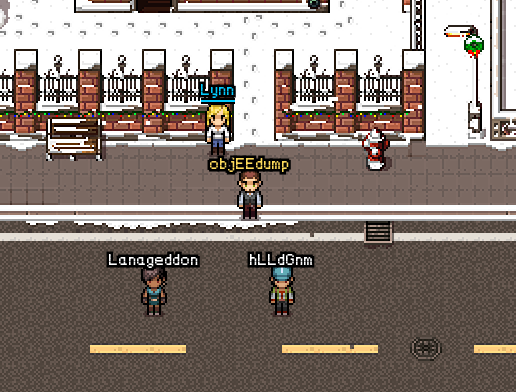

Part 1: Dance of the Sugar Gnome Fairies: Curious Wireless Packets
--------

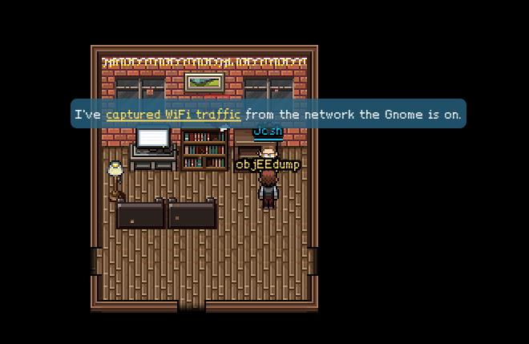

After we retreived the [first packet capture](downloads/giyh-capture.pcap), we first opened it up [Wireshark] to examine the network traffic more closely. 

It was easy enough to see the broadcast packets and beacon frames, and we saw the two [SSID]s titled `December` and `DosisHome-Guest`. 

As we looked through the [pcap] more and more, we eventually found some interesting stuff in the packets sent over [DNS]. In the raw text they carried, it looked they carried some [base64] encoded data! Ha, the trailing `=` equal signs always give it away.

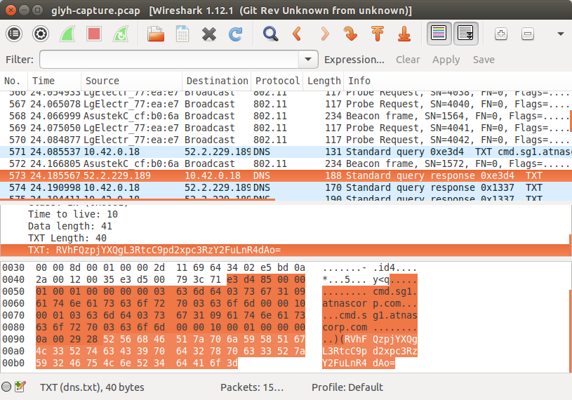

We whipped up a [Python][Python] [script `pcap_extract_baseline.py`](our_code/pcap_extract_baseline.py) to scrape through all the packets and pick out the interesting stuff. It would use [`scapy`][scapy] to run through the packets, and the [`base64`][base64] module to decode the data. That made it pretty easy to see what was going on. (We wrote our script before the [hand-holding helper one](downloads/gnomeitall.py) was released in the game).

 python
#!/usr/bin/env python

from scapy.all import *
import base64 as b

pcap = rdpcap('../downloads/giyh-capture.pcap')
udp_packets = pcap[UDP]

for packet in udp_packets:

	if DNS in packet[0]:
		carved_data = None
		try:
			carved_data = b.b64decode(packet[0][1].an.rdata)
		except:
			pass

		if ( carved_data ): 
			print carved_data


With the output of [our script](our_code/pcap_extract_baseline.py) it was easy to identify commands being executed and even data for a file being passed over the wire. 

To make things a little easier on the eyes (not spewing the data for the transferred file everywhere), we actually threw [our script](our_code/pcap_extract_baseline.py) into [`strings`][strings], and got to see more clearly the commands being sent across the network. 

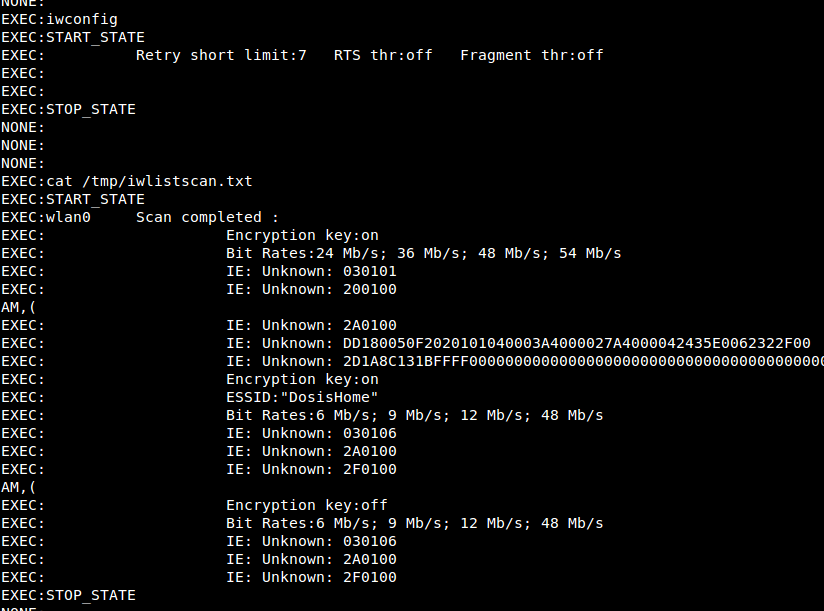

So to answer the first question...

--------

__1) Which commands are sent across the Gnome’s command-and-control channel?__

The commands we saw were:

* __`iwconfig`__
* __`cat /tmp/iwlistscan.txt`__

--------

And to answer the second question, we already had a [working script](our_code/pcap_extract_baseline.py)... all we needed it to do was scrape out the file data in the loop and then jam it all together. So we created a file handle and added whatever we processed to it.

Here's the jist of our modification, how it added into the loop:

``` python
if ( carved_data.startswith('FILE:') ):
	piece_of_file =  carved_data.split('FILE:')[1]
	handle.write(piece_of_file)
```

Keep in mind the `handle` variable would have been created at the top of the new script; you can see the whole change in our separate script [`pcap_extract_image.py`](our_code/pcap_extract_baseline.py)

And our code gives us the file! As it turns out it was a [JPG] image... of the Gnome in your Home!

--------

__2) What image appears in the photo the Gnome sent across the channel from the Dosis home?__

The image sent across the channel was:


--------

Looks like the text in the image is: `GnomeNET-NorthAmerica`. We showed it to Josh, and he said we were right!

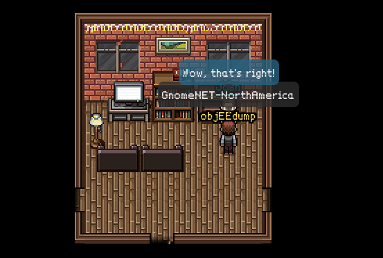

So next we go to talk to Jessica and get [the firmware](downloads/giyh-firmware-dump.bin), and move onto the next part!

Part 2: I’ll be Gnome for Christmas: Firmware Analysis for Fun and Profit
--------

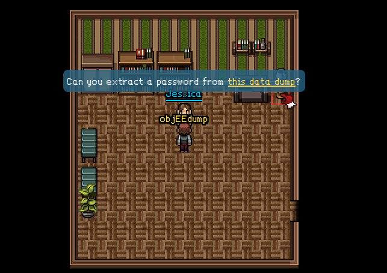

When we got [the firmware](downloads/giyh-firmware-dump.bin) downloaded, we ran [`binwalk -e`][binwalk] to extract out a file system. Easy enough, we had a whole [Linux] file system on our hands.

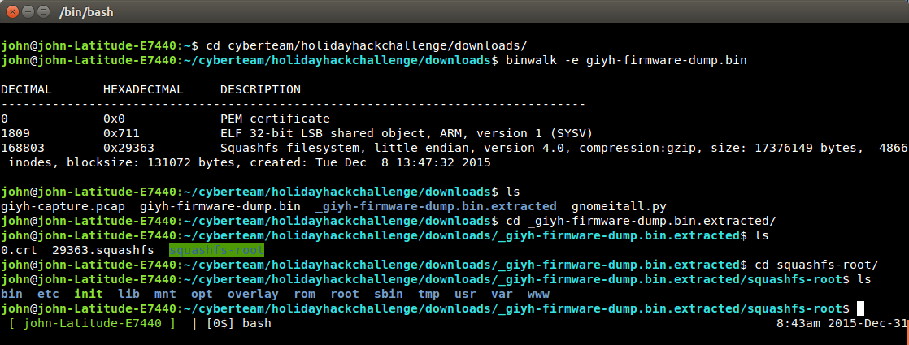

To find out a bit more information on the kind of system we were working with, we checked out any release information stored in the `/etc` directory.

``` bash
/etc$ cat *release
DISTRIB_ID='OpenWrt'
DISTRIB_RELEASE='Bleeding Edge'
DISTRIB_REVISION='r47650'
DISTRIB_CODENAME='designated_driver'
DISTRIB_TARGET='realview/generic'
DISTRIB_DESCRIPTION='OpenWrt Designated Driver r47650'
DISTRIB_TAINTS=''
```

And we saw that the system had a `/www` directory so we could see some web files. After we changed into that directory, it was clear what the web server was running.

``` bash
/www$ ls
app.js  bin  files  node_modules  package.json  public  routes  views
```

Between all the [`.js` ][JavaScript] [JavaScript] files and even the blatant `node_modules` directory name, it was evident.

--------

__3) What operating system and CPU type are used in the Gnome?  What type of web framework is the Gnome web interface built in?__

* The Gnome is running __[OpenWRT]__ with an __x86_64 CPU__.
* The web interface is built in the __[Node.js][node.js]__ web framework.

--------

While we were hanging out in the `/etc` directory, we also saw a `mongod.conf` file, so it seemed the Gnome was running [MongoDB]. 

And this was clear even when we were poking around in the `/www` directory to see the web server files. Obviously in a lot of the [JavaScript] source code it was necessary to reference the database, so we could see it was clearly using [Mongo].

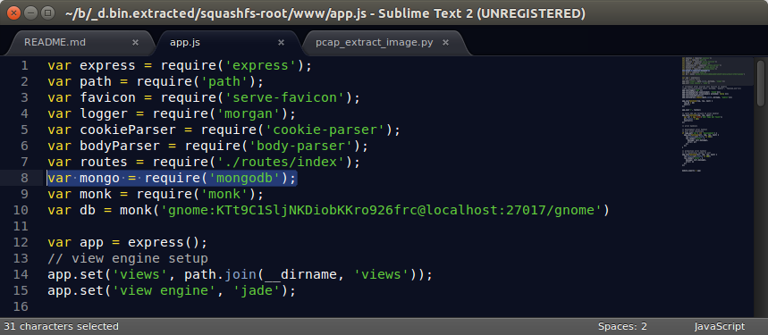

Now earlier, when we saw that `mongod.conf` file in `/etc`, we took a look at it to see if it had anything interesting: and it told us the [MongoDB] files lived in `/opt/mongodb`.

``` bash
/etc$ cat mongod.conf
# LOUISE: No logging, YAY for /dev/null
# AUGGIE: Louise, stop being so excited to basic Unix functionality
# LOUISE: Auggie, stop trying to ruin my excitement!

systemLog:
  destination: file
  path: /dev/null
  logAppend: true
storage:
  dbPath: /opt/mongodb
net:
  bindIp: 127.0.0.1
```

It's a shame there is no logging. ;)

So in the `/opt/mongodb` directory we can see all of the database files that [Mongo] is using. Cool! 

We actually found the password when we were perusing `gnome.0` in [`hexedit`][hexedit]. 

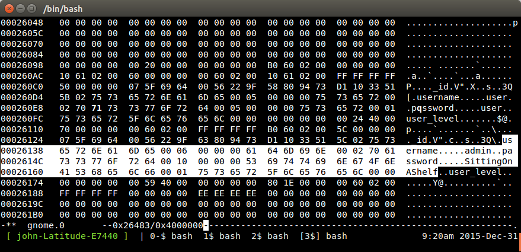

We could have totally found it with [`strings`][strings], even, but for whatever reason we were in [`hexedit`][hexedit] first. Regardless, we got the password and had the answer.

--------

__4) What kind of a database engine is used to support the Gnome web interface? What is the plaintext password stored in the Gnome database?__


* The Gnome web interface is using [__MongoDB__][MongoDB] as its database.
* The plaintext password stored in the database for the admin user is `SittingOnAShelf`.

--------

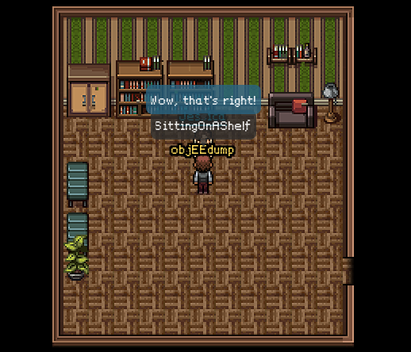

We showed Jessica the password, and it looks like we got it right. Next, we'll talk to Dan and Josh Wright and move onto the next part!

Part 3: Let it Gnome! Let it Gnome! Let it Gnome! Internet-Wide Scavenger Hunt
------------

We took a look at the `/etc/hosts` file within our [firmware](downloads/giyh-firmware-dump.bin) to hopefully find an [IP address] of a running SuperGnome. Looks like we got it!

There is even a comment that this SuperGnome is in North America. Okay, that makes sense, considering the [image](our_code/carved_image.jpg) we got in Part 1. So if we tried to poke at this [IP address] online in a web browser... we get a response, it's up!

```
$ cat /etc/hosts
127.0.0.1 localhost

::1     localhost ip6-localhost ip6-loopback
ff02::1 ip6-allnodes
ff02::2 ip6-allrouters

# LOUISE: NorthAmerica build
52.2.229.189    supergnome1.atnascorp.com sg1.atnascorp.com supergnome.atnascorp.com sg.atnascorp.com
```

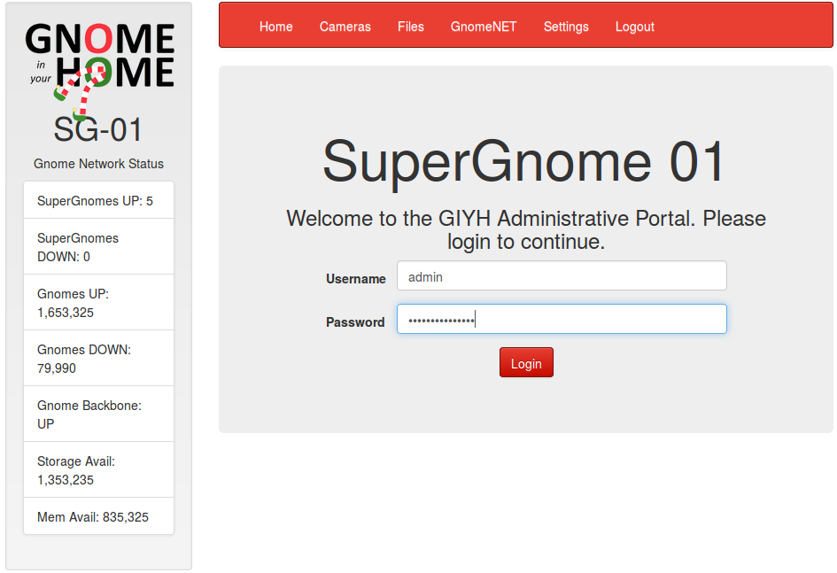

Apparently this is [SuperGnome 01].

And, since we were able to get a password out of the database, we can log in with those credentials, `admin` and `SittingOnAShelf`. Now we can poke around with the live box and see if we can interact with it in any other ways and get more information. Since we've got the source code within the [firmware](downloads/giyh-firmware-dump.bin), it should be easy to see everything the web server is actually doing.

But, we've got to find all the other SuperGnomes. Well, uh, how do we do that?

We were stuck here for a good while (so we passed the time going through the "in-game" achievements and talking with all of the NPCs).

Eventually we realized what the big hint to "sho Dan what you've found" was, considering it was repeated enough. We needed to _literally_ [Shodan] the SuperGnome... as in search in [Shodan] _'SuperGnome!'_

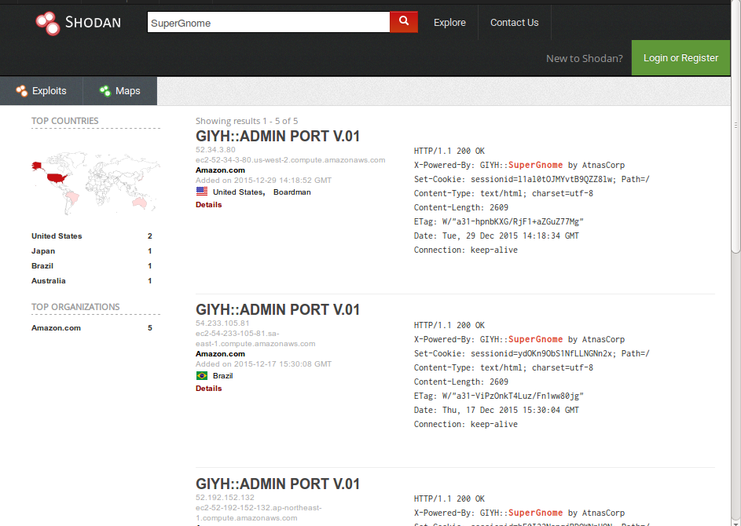

That gave us all the information we needed to answer the questions for this part.


--------

__5) What are the IP addresses of the five SuperGnomes scattered around the world, as verified by Tom Hessman in the Dosis neighborhood?__

The [IP addresses] of the five SuperGnomes are as follows:

* [SuperGnome 01]: __52.2.229.189__
* [SuperGnome 02]: __52.34.3.80__
* [SuperGnome 03]: __52.64.191.71__
* [SuperGnome 04]: __52.192.152.132__
* [SuperGnome 05]: __54.233.105.81__

--------

__6) Where is each SuperGnome located geographically?__

The locations for the SuperGnomes are: 

* [SuperGnome 01]: __"Ashburn, United States"__
* [SuperGnome 02]: __"Boardman, United States"__
* [SuperGnome 03]: __"Sydney, Australia"__
* [SuperGnome 04]: __"Tokyo, Japan"__
* [SuperGnome 05]: __"Brazil"__

--------

We verified with Tom that all of these [IP addresses] are in fact in scope. Looks like we can move onto the next part!

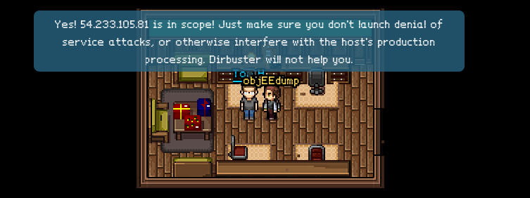

Part 4: There’s No Place Like Gnome for the Holidays: Gnomage Pwnage
----------

Now that we were in a position where we could really mess with all of the SuperGnomes, we cracked down on finding vulnerabilties and pillaging for whatever we could.

We had looked at [SuperGnome 01] extensively before we actually found the others through [Shodan], so we downloaded everything off of their [`/files`](http://52.2.229.189/files) page. 

* The `20141226101055.zip` contained yet another [pcap] file with a clear text email we could read right in [Wireshark], by choosing to `Follow TCP Stream`. The email was from "c" <c@atnascorp.com>, to <jojo@atnascorp.com>, discussing the architecture of the Gnome in Your Home. It was clear they had attached a [JPG] image, but it was encoded in [base64]. We were able to retrieve the data and decode it to get the following image.
* The `camera_feed_overlap_error.zip` contained an image of obviously a camera feed that was overlapped; we pieced together from reading through the [GnomeNET messages](http://52.2.229.189/gnomenet) that we needed to use this to try and get the 6th image for the boss' office. Since all of the camera pictures have been [XOR]'d, if we were able to snag all the images we could "unXOR" them and get the boss' picture!
* `factory_cam_1.zip` of course had the factory image from this SuperGnome, that we figured we should use to try and retrieve the 6th image from the boss' room, if we were to gather all 5 factory images.
* `gnome.conf` was apparently the goal for getting into each SuperGnome; so we downloaded it and started a collection.
* The `gnome_firmware_rel_notes.txt` didn't look like it had too much information for us other than the notion of the SuperGnome's sniffer.
* `sgnet.zip` looked like it included the source code for some binaries used to manage one or more of the SuperGnomes. We figured we would have to try and break the code at some point, but we it didn't seem like we needed it just then -- but we still pocketed it for safekeeping.
* The `sniffer_hit_list.txt` looked interesting, but it seemed like nothing we could work with at the moment.


We perused through the [`/cameras`](http://52.2.229.189/cameras) section but we obviously were not able to view more than two cameras, so we left that alone. We couldn't really interact with the web pages of [SuperGnome 01], so we figured we would try looking for vulnerabilities with the others.

Since we had the source code of the webpages, we figured we would start by more thoroughly examining the source code and then beginning to poke at the other SuperGnomes.

We opened up what seemed to be the logic for the webserver, `index.js` under the `/www/routes` directory of the [firmware](downloads/giyh-firmware-dump.bin).

I'll try and enumerate what vulnerabilities we found and the progression we had followed to compromise some of the SuperGnomes. __I hope this will act as a long-winded answer to questions seven and eight: 7) Please describe the vulnerabilities you discovered in the Gnome firmware, and 8) Describe the technique you used to gain access to each SuperGnome’s gnome.conf file.__

Something we saw interesting in the source code was this "camera viewer", under `/cam` that allowed you to look at an individual camera image if you gave it an [HTTP][HTTP] [GET request] variable.

In the [firmware](downloads/giyh-firmware-dump.bin)'s code  ([SuperGnome 01]'s rendition of the software), a user apparently by the name of 'Stuart' had commented out a line of code that would just check if the supplied filename variable had the text '[.png]' _in_ the filename. Under that condition, the filename wouldn't have to have [.png] as a file extension.. it just had to be somewhere in the string. The current code in [SuperGnome 01] would append on the '[.png]' string no matter what, but the comment led us to wonder... do some of the other SuperGnomes act this way?

``` js
// CAMERA VIEWER
// STUART: Note: to limit disclosure issues, this code checks to make sure the user asked for a .png file
router.get('/cam', function(req, res, next) {
  var camera = unescape(req.query.camera);
  // check for .png
  //if (camera.indexOf('.png') == -1) // STUART: Removing this...I think this is a better solution... right?
  camera = camera + '.png'; // add .png if its not found
  console.log("Cam:" + camera);
  fs.access('./public/images/' + camera, fs.F_OK | fs.R_OK, function(e) {
    if (e) {
	    res.end('File ./public/images/' + camera + ' does not exist or access denied!');
    }
  });
  fs.readFile('./public/images/' + camera, function (e, data) {
    res.end(data);
  });
});
```

We naturally moved onto [SuperGnome 02] after [SuperGnome 01], and [SG02][SuperGnome 02] was an interesting case because we could log in with the `admin` and `SittingOnAShelf` credentials we initially discovered, but we could not download anything from the [`/files`](http://52.34.3.80/files) page. But, we still wanted that `gnome.conf` file! 

So when we were [manually testing that `/cam` page](http://52.34.3.80/cam?camera=experiment.png.works?)... it did not append a '[.png]' extension if we supplied one in the string! It just checked to see if the string was in there, just like the commented code had suggested!
  
After some more tinkering with [SuperGnome 02], we saw we were able to upload our own settings file from the [`/settings`](http://52.34.3.80/settings) page. This let us create a file on the server... could we exploit that?

``` js
// SETTINGS UPLOAD
router.post('/settings', function(req, res, next) {
  if (sessions[sessionid].logged_in === true && sessions[sessionid].user_level 99) { // AUGGIE: settings upload allowed for admins (admins are 100, currently)
    var filen = req.body.filen;
    var dirname = '/gnome/www/public/upload/' + newdir() + '/' + filen;
    var msgs = [];
    var free = 0;
    disk.check('/', function(e, info) {
      free = info.free;
    });
    try {
      fs.mknewdir(dirname.substr(0,dirname.lastIndexOf('/')));
      msgs.push('Dir ' + dirname.substr(0,dirname.lastIndexOf('/')) + '/ created successfully!');
    } catch(e) {
      if (e.code != 'EEXIST')
	throw e;
    }
    if (free < 99999999999) { // AUGGIE: I think this is breaking uploads?  Stuart why did you set this so high?
      msgs.push('Insufficient space!  File creation error!');
    }
    res.msgs = msgs;
    next();
  } else
    res.render('index', { title: 'GIYH::ADMIN PORT V.01', session: sessions[sessionid], res: res });
});
``` 

The source code tells us that this functionality will actually create a new directory for us, based off the 'lastIndexOf()' a `/` forward-slash character. Well then... what is to stop us from creating a directory with the string '[.png]' in its name? If we did that, we could use that directory as a "jumping off-point" in the [`/cam`](52.34.3.80/cam) page and see if we could get any other files, _not just camera images!_

When we tried this, we weren't able to actually upload the file (just like it is explained in the source code comments)... but we still created our directory!

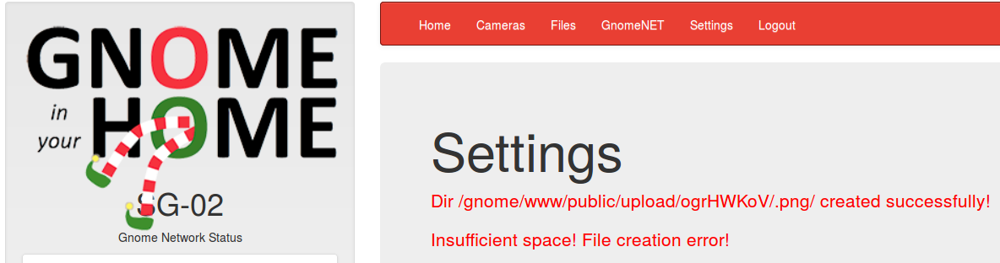

So in combination with that directory we were able to create through the [`/settings`](http://52.34.3.80/settings) page and the 'camera viewer' service in the [`/cam`](52.34.3.80/cam) page... we were able to find a [local file inclusion] vulnerability!

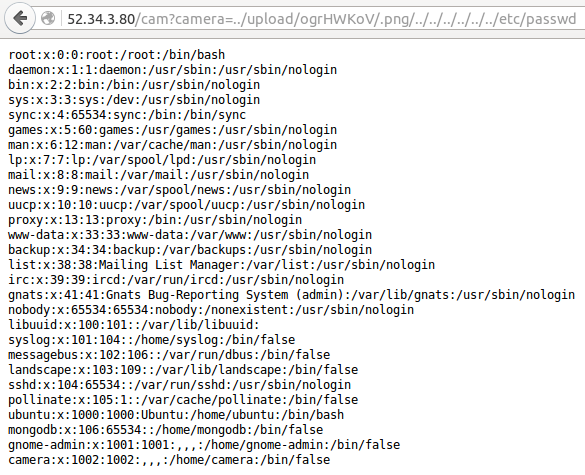

Now, we could grab some more interesting stuff from the webserver. Source code, the files in [`/files`](http://52.34.3.80/files) we were previously unable to snag (including our goal `gnome.conf`), and any other logs or info we wanted. 

Just like Josh Wright hinted at in-game, we were able to combine that file upload feature to get that [LFI] attack. So, after pillaging everything we could, we could consider [SuperGnome 02] compromised!

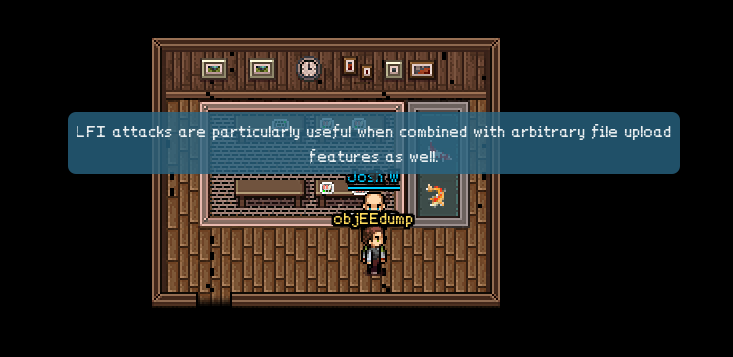

Here's a break down of what we snagged from [SuperGnome 02]:

* `/www/routes/index.js` to see its source code and get ideas for other vulnerabilities
* `gnome.conf`, the `factory_cam_2.png` and all other files (we read another email in the [pcap], but again we just pocketed it)
* `/etc/mongod.conf` to see how the [Mongo] database was set up. 
	* I tried to snag the database files `/var/lib/mongodb/gnome.0` but I could not download them; I assume they are not owned by the current user and are instead owned by the [MongoDB] user
* `/var/lib/mongod.log` ... we were still able to see the log file, though! __So I caught the password for `stuart`: `MyBossIsCrazy`.__
* `.bash_history` to see if there were any interesting commands run recently..
* `/var/log/boot.log` to get more information about the machine, even the local [IP Address] and gateway!

After considering [SuperGnome 02] complete and even grabbing a new set of credentials out of it, we considered it a success and moved on to [SuperGnome 03].

But, [SuperGnome 03] seemed out of reach so far. Our `admin` and `SittingOnAShelf` login did not work and neither did our newly acquired `stuart` and `MyBossIsCrazy`. Dang. We moved onto [SuperGnome 04]. 

[SuperGnome 04] is another case where we can log in with `admin` (couldn't with `stuart`), but cannot download any of the files (including `gnome.conf`) from [`/files`](http://52.192.152.132/files).

But it looks like we could actually upload a file to that [`/files`](http://52.192.152.132/files) page, which differs from [SuperGnome 01] and [02][SuperGnome 02]. We took a look at the source code from the [firmware](downloads/giyh-firmware-dump.bin), and it looks like the functionality works like this:

``` js
// FILES UPLOAD
router.post('/files', upload.single('file'), function(req, res, next) {
  if (sessions[sessionid].logged_in === true && sessions[sessionid].user_level 99) { // NEDFORD: this should be 99 not 100 so admins can upload
    var msgs = [];
    file = req.file.buffer;
    if (req.file.mimetype === 'image/png') {
      msgs.push('Upload successful.');
      var postproc_syntax = req.body.postproc;
      console.log("File upload syntax:" + postproc_syntax);
      if (postproc_syntax != 'none' && postproc_syntax !== undefined) {
        msgs.push('Executing post process...');
        var result;
        d.run(function() {
          result = eval('(' + postproc_syntax + ')');
        });
        // STUART: (WIP) working to improve image uploads to do some post processing.
        msgs.push('Post process result: ' + result);
      }
      msgs.push('File pending super-admin approval.');
      res.msgs = msgs;
    } else {
      msgs.push('File not one of the approved formats: .png');
      res.msgs = msgs;
    }
  } else
    res.render('index', { title: 'GIYH::ADMIN PORT V.01', session: sessions[sessionid], res: res });
  next();
});
```

Our eyes were immediately drawn to the `eval` statement. If we could successfully upload a file and get that `eval` statement to run, we might be able to get [Node.js] to run any code for us; maybe even execute a system shell command, like with [`bash`][bash].

It looked like that `postproc_syntax` variable is even something we supply. We could definitely inject it with some [JavaScript] code and try to exploit it.

[From the webpage](http://52.192.152.132/files), the `postproc_syntax` variable seemed to be filled from a drop-down list. We obviously wanted to enter different text than what those options were offering us, so we just changed the element in our web browser so we could feed it any data. We did this simply with the 'Inspect Element' option through [Firefox].

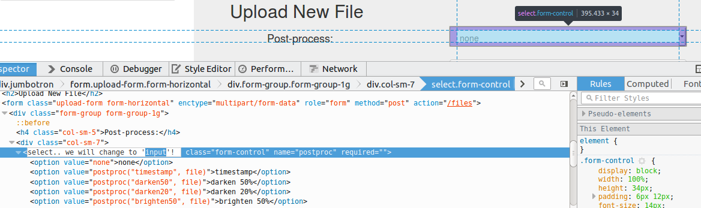

Now we could enter any text. If we gave the page a [PNG] image and actually gave it some [JavaScript] to execute, we had exploited another vulnerability: [remote code execution]!

Here's the [JavaScript] we had the server run, so we could actually run system commands:

``` js
require('child_process').exec('<our_command_would_go_here>')
``` 

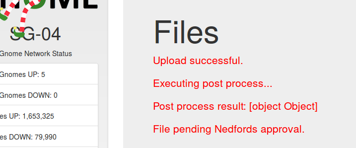

We got a response of a [JavaScript] object, so it seemed like it worked. But... there was no way to really tell. We weren't really able to see the output of the command, and it didn't seem like we were able to successfully run anything that would 'phone home' and prove to us that our commands really were getting in.

We weren't able to get a [`netcat`][netcat] listener, or a backdoor; we tried -- a lot. But we couldn't just let this go; if we had remote code execution of [SuperGnome 04], we had another box down. So we tried something crafty to really see if our commands were running.

What we did is we ran a [`curl`][curl] command to have the [SuperGnome][SuperGnome 04] post its command output to something like an online clipboard; where you could just thow up data and retrieve it later. We used [`cl1p.net`][cl1p.net]. From there, if the command successfully ran, we could view the output and analyze our results. 

It was messy; really messy; but it worked. We actually ended up [scripting something](our_code/sg04_shell.sh) so that we would run a [`curl`][curl] command on our own and pull the results from [`cl1p.net`][cl1p.net] -- it was like a simulated [shell]. Granted, we only had output -- it was not a very stable [shell] or terminal where we could supply more input with other interactive commands -- but it was still something.

Please [check out our code](our_code/sg04_shell.sh) to create that simulated shell. It works off of a `sessionid` cookie for the [SuperGnome 04] so it understands you are logged in and can upload files, and then it automates the exploit for you. Much better than trying to do it through the web pages over and over again.

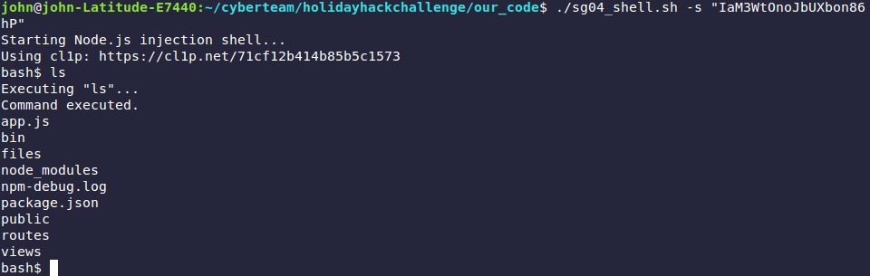

With this set up, we could start to pillage. We grabbed the usual, source code and things within [`/files`](http://52.192.152.132/files), including `gnome.conf`. Those were just plain text files, so they were easy to transfer. Things like the [`.zip`][.zip] files were not as easy. We could still transfer them through our simulated shell; it just would be much more messy than it already was.

But, since we had a [remote code execution] on this box, we wondered if we could actually explore more of its database. We could connect to the [MongoDB] server and dump information, probably with just one single command. We already had the database password: we had it all along, once we had the [firmware](downloads/giyh-firmware-dump.bin). It has been stored in `app.js` of the `/www` directory for each SuperGnome; and the password did not even change between each one.

So we did some research and cooked up this one line to dump anything interesting from the database; and we got some interesting results!

``` bash
$ mongoexport --db gnome --host localhost --username gnome --password KTt9C1SljNKDiobKKro926frc --port 27017 -c users
Executing "mongoexport --db gnome --host localhost --username gnome --password KTt9C1SljNKDiobKKro926frc --port 27017 -c users"...
Command executed.
2016-01-03T04:22:21.552+0000    connected to: localhost:27017
{"_id":{"$oid":"56229f58809473d11033515b"},"username":"user","password":"user","user_level":10.0}
{"_id":{"$oid":"56229f63809473d11033515c"},"username":"admin","password":"SittingOnAShelf","user_level":100.0}
{"_id":{"$oid":"5647438777cb0339cd14fd09"},"username":"nedford","password":"AllIWantForXmasIsYourPresents","user_level":100.0}
```

We found a user `nedford` and his password `AllIWantForXmasIsYourPresents`. Ha! This must be the same Nedford we saw in the source code comments, and the individual whose approval we need to upload any files! So, if we log in as him, we can download _anything_ off the [`/files`](http://52.192.152.132/files) page easily through the regular web interface.

From there, we got the [`.zip`][.zip] files downloaded. That led us to answer the final set of questions.

We retrieved the [pcap] file from [SuperGnome 04] and were able to clearly see another email, again from "c" but this time addressed to "psychdoctor@whovillepsychiatrists.com". Interestingly enough, the email is signed from "Cindy Lou Who". 

This leads us to the last few answers...


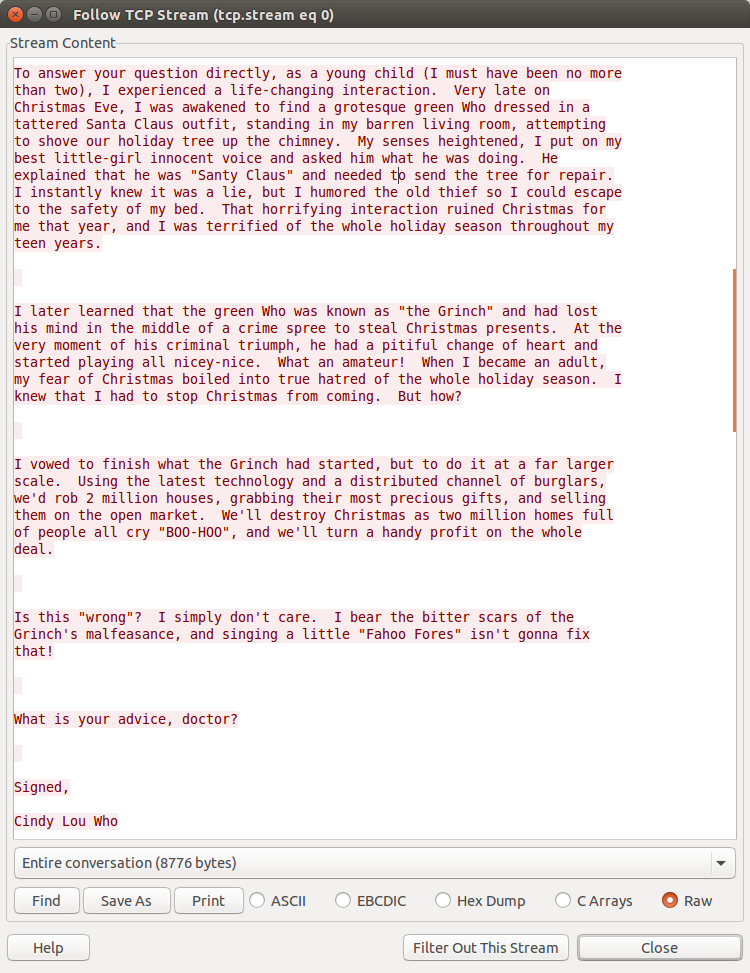

--------

__9) Based on evidence you recover from the SuperGnomes’ packet capture ZIP files and any staticky images you find, what is the nefarious plot of ATNAS Corporation?__

It looks as though the nefarious plot of the ATNAS corporation is to use these "Gnome in your Home" Internet-attached devices as a means of __spying on over two million homes and peering into living rooms__, to see what presents they will have for Christmas. Then, the ATNAS corporation will __steal from these homes and sell their gifts__ for more and more riches!

--------

__10) Who is the villain behind the nefarious plot?__

The evil mastermind behind this entire operation is none other than the __Miss Cindy Lou Who!__

--------


[netcat]: https://en.wikipedia.org/wiki/Netcat
[Wikipedia]: https://www.wikipedia.org/
[Linux]: https://www.linux.com/
[man page]: https://en.wikipedia.org/wiki/Man_page
[PuTTY]: http://www.putty.org/
[ssh]: https://en.wikipedia.org/wiki/Secure_Shell
[Windows]: http://www.microsoft.com/en-us/windows
[virtual machine]: https://en.wikipedia.org/wiki/Virtual_machine
[operating system]:https://en.wikipedia.org/wiki/Operating_system
[OS]: https://en.wikipedia.org/wiki/Operating_system
[VMWare]: http://www.vmware.com/
[VirtualBox]: https://www.virtualbox.org/
[hostname]: https://en.wikipedia.org/wiki/Hostname
[port number]: https://en.wikipedia.org/wiki/Port_%28computer_networking%29
[distribution]:https://en.wikipedia.org/wiki/Linux_distribution
[Ubuntu]: http://www.ubuntu.com/
[ISO]: https://en.wikipedia.org/wiki/ISO_image
[standard streams]: https://en.wikipedia.org/wiki/Standard_streams
[standard output]: https://en.wikipedia.org/wiki/Standard_streams
[standard input]: https://en.wikipedia.org/wiki/Standard_streams
[read]: http://ss64.com/bash/read.html
[variable]: https://en.wikipedia.org/wiki/Variable_%28computer_science%29
[command substitution]: http://www.tldp.org/LDP/abs/html/commandsub.html
[permissions]: https://en.wikipedia.org/wiki/File_system_permissions
[redirection]: http://www.tldp.org/LDP/abs/html/io-redirection.html
[pipe]: http://www.tldp.org/LDP/abs/html/io-redirection.html
[piping]: http://www.tldp.org/LDP/abs/html/io-redirection.html
[tmp]: http://www.tldp.org/LDP/Linux-Filesystem-Hierarchy/html/tmp.html
[curl]: http://curl.haxx.se/
[cl1p.net]: https://cl1p.net/
[request]: http://www.w3.org/Protocols/rfc2616/rfc2616-sec5.html
[POST request]: https://en.wikipedia.org/wiki/POST_%28HTTP%29
[Python]: http://python.org/
[interpreter]: https://en.wikipedia.org/wiki/List_of_command-line_interpreters
[requests]: http://docs.python-requests.org/en/latest/
[urllib]: https://docs.python.org/2/library/urllib.html
[file handling with Python]: https://docs.python.org/2/tutorial/inputoutput.html#reading-and-writing-files
[bash]: https://www.gnu.org/software/bash/
[Assembly]: https://en.wikipedia.org/wiki/Assembly_language
[the stack]:  https://en.wikipedia.org/wiki/Stack_%28abstract_data_type%29
[register]: http://www.tutorialspoint.com/assembly_programming/assembly_registers.htm
[hex]: https://en.wikipedia.org/wiki/Hexadecimal
[hexadecimal]: https://en.wikipedia.org/wiki/Hexadecimal
[archive file]: https://en.wikipedia.org/wiki/Archive_file
[zip file]: https://en.wikipedia.org/wiki/Zip_%28file_format%29
[.zip]: https://en.wikipedia.org/wiki/Zip_%28file_format%29
[gigabytes]: https://en.wikipedia.org/wiki/Gigabyte
[GB]: https://en.wikipedia.org/wiki/Gigabyte
[GUI]: https://en.wikipedia.org/wiki/Graphical_user_interface
[Wireshark]: https://www.wireshark.org/
[FTP]: https://en.wikipedia.org/wiki/File_Transfer_Protocol
[client and server]: https://simple.wikipedia.org/wiki/Client-server
[RETR]: http://cr.yp.to/ftp/retr.html
[FTP server]: https://help.ubuntu.com/lts/serverguide/ftp-server.html
[SFTP]: https://en.wikipedia.org/wiki/SSH_File_Transfer_Protocol
[SSL]: https://en.wikipedia.org/wiki/Transport_Layer_Security
[encryption]: https://en.wikipedia.org/wiki/Encryption
[HTML]: https://en.wikipedia.org/wiki/HTML
[Flask]: http://flask.pocoo.org/
[SQL]: https://en.wikipedia.org/wiki/SQL
[and]: https://en.wikipedia.org/wiki/Logical_conjunction
[Cyberstakes]: https://cyberstakesonline.com/
[cat]: https://en.wikipedia.org/wiki/Cat_%28Unix%29
[symbolic link]: https://en.wikipedia.org/wiki/Symbolic_link
[ln]: https://en.wikipedia.org/wiki/Ln_%28Unix%29
[absolute path]: https://en.wikipedia.org/wiki/Path_%28computing%29
[CTF]: https://en.wikipedia.org/wiki/Capture_the_flag#Computer_security
[Cyberstakes]: https://cyberstakesonline.com/
[OverTheWire]: http://overthewire.org/
[Leviathan]: http://overthewire.org/wargames/leviathan/
[ls]: https://en.wikipedia.org/wiki/Ls
[grep]: https://en.wikipedia.org/wiki/Grep
[strings]: http://linux.die.net/man/1/strings
[ltrace]: http://linux.die.net/man/1/ltrace
[C]: https://en.wikipedia.org/wiki/C_%28programming_language%29
[strcmp]: http://linux.die.net/man/3/strcmp
[access]: http://pubs.opengroup.org/onlinepubs/009695399/functions/access.html
[system]: http://linux.die.net/man/3/system
[real user ID]: https://en.wikipedia.org/wiki/User_identifier
[effective user ID]: https://en.wikipedia.org/wiki/User_identifier
[brute force]: https://en.wikipedia.org/wiki/Brute-force_attack
[for loop]: https://en.wikipedia.org/wiki/For_loop
[bash programming]: http://tldp.org/HOWTO/Bash-Prog-Intro-HOWTO.html
[Behemoth]: http://overthewire.org/wargames/behemoth/
[command line]: https://en.wikipedia.org/wiki/Command-line_interface
[command-line]: https://en.wikipedia.org/wiki/Command-line_interface
[cli]: https://en.wikipedia.org/wiki/Command-line_interface
[PHP]: https://php.net/
[URL]: https://en.wikipedia.org/wiki/Uniform_Resource_Locator
[TamperData]: https://addons.mozilla.org/en-US/firefox/addon/tamper-data/
[Firefox]: https://www.mozilla.org/en-US/firefox/new/?product=firefox-3.6.8&os=osx%E2%8C%A9=en-US
[Caesar Cipher]: https://en.wikipedia.org/wiki/Caesar_cipher
[Google Reverse Image Search]: https://www.google.com/imghp
[PicoCTF]: https://picoctf.com/
[JavaScript]: https://www.javascript.com/
[base64]: https://en.wikipedia.org/wiki/Base64
[client-side]: https://en.wikipedia.org/wiki/Client-side_scripting
[client side]: https://en.wikipedia.org/wiki/Client-side_scripting
[javascript:alert]: http://www.w3schools.com/js/js_popup.asp
[Java]: https://www.java.com/en/
[2147483647]: https://en.wikipedia.org/wiki/2147483647_%28number%29
[XOR]: https://en.wikipedia.org/wiki/Exclusive_or
[XOR cipher]: https://en.wikipedia.org/wiki/XOR_cipher
[quipqiup.com]: http://www.quipqiup.com/
[PDF]: https://en.wikipedia.org/wiki/Portable_Document_Format
[pdfimages]: http://linux.die.net/man/1/pdfimages
[ampersand]: https://en.wikipedia.org/wiki/Ampersand
[URL encoding]: https://en.wikipedia.org/wiki/Percent-encoding
[Percent encoding]: https://en.wikipedia.org/wiki/Percent-encoding
[URL-encoding]: https://en.wikipedia.org/wiki/Percent-encoding
[Percent-encoding]: https://en.wikipedia.org/wiki/Percent-encoding
[endianness]: https://en.wikipedia.org/wiki/Endianness
[ASCII]: https://en.wikipedia.org/wiki/ASCII
[struct]: https://docs.python.org/2/library/struct.html
[pcap]: https://en.wikipedia.org/wiki/Pcap
[packet capture]: https://en.wikipedia.org/wiki/Packet_analyzer
[HTTP]: https://en.wikipedia.org/wiki/Hypertext_Transfer_Protocol
[Wireshark filters]: https://wiki.wireshark.org/DisplayFilters
[SSL]: https://en.wikipedia.org/wiki/Transport_Layer_Security
[Assembly]: https://en.wikipedia.org/wiki/Assembly_language
[Assembly Syntax]: https://en.wikipedia.org/wiki/X86_assembly_language#Syntax
[Intel Syntax]: https://en.wikipedia.org/wiki/X86_assembly_language
[Intel or AT&T]: http://www.imada.sdu.dk/Courses/DM18/Litteratur/IntelnATT.htm
[AT&T syntax]: https://en.wikibooks.org/wiki/X86_Assembly/GAS_Syntax
[GET request]: https://en.wikipedia.org/wiki/Hypertext_Transfer_Protocol#Request_methods
[GET requests]: https://en.wikipedia.org/wiki/Hypertext_Transfer_Protocol#Request_methods
[IP Address]: https://en.wikipedia.org/wiki/IP_address
[IP Addresses]: https://en.wikipedia.org/wiki/IP_address
[MAC Address]: https://en.wikipedia.org/wiki/MAC_address
[session]: https://en.wikipedia.org/wiki/Session_%28computer_science%29
[Cookie Manager+]: https://addons.mozilla.org/en-US/firefox/addon/cookies-manager-plus/
[hexedit]: http://linux.die.net/man/1/hexedit
[Google]: http://google.com/
[Scapy]: http://www.secdev.org/projects/scapy/
[ARP]: https://en.wikipedia.org/wiki/Address_Resolution_Protocol
[UDP]: https://en.wikipedia.org/wiki/User_Datagram_Protocol
[SQL injection]: https://en.wikipedia.org/wiki/SQL_injection
[sqlmap]: http://sqlmap.org/
[sqlite]: https://www.sqlite.org/
[MD5]: https://en.wikipedia.org/wiki/MD5
[OpenSSL]: https://www.openssl.org/
[Burpsuite]:https://portswigger.net/burp/
[Burpsuite.jar]:https://portswigger.net/burp/
[Burp]:https://portswigger.net/burp/
[NULL character]: https://en.wikipedia.org/wiki/Null_character
[Format String Vulnerability]: http://www.cis.syr.edu/~wedu/Teaching/cis643/LectureNotes_New/Format_String.pdf
[printf]: http://pubs.opengroup.org/onlinepubs/009695399/functions/fprintf.html
[argument]: https://en.wikipedia.org/wiki/Parameter_%28computer_programming%29
[arguments]: https://en.wikipedia.org/wiki/Parameter_%28computer_programming%29
[parameter]: https://en.wikipedia.org/wiki/Parameter_%28computer_programming%29
[parameters]: https://en.wikipedia.org/wiki/Parameter_%28computer_programming%29
[Vortex]: http://overthewire.org/wargames/vortex/
[socket]: https://docs.python.org/2/library/socket.html
[file descriptor]: https://en.wikipedia.org/wiki/File_descriptor
[file descriptors]: https://en.wikipedia.org/wiki/File_descriptor
[Forth]: https://en.wikipedia.org/wiki/Forth_%28programming_language%29
[github]: https://github.com/
[buffer overflow]: https://en.wikipedia.org/wiki/Buffer_overflow
[try harder]: https://www.offensive-security.com/when-things-get-tough/
[segmentation fault]: https://en.wikipedia.org/wiki/Segmentation_fault
[seg fault]: https://en.wikipedia.org/wiki/Segmentation_fault
[segfault]: https://en.wikipedia.org/wiki/Segmentation_fault
[shellcode]: https://en.wikipedia.org/wiki/Shellcode
[sploit-tools]: https://github.com/SaltwaterC/sploit-tools
[Kali]: https://www.kali.org/
[Kali Linux]: https://www.kali.org/
[gdb]: https://www.gnu.org/software/gdb/
[gdb tutorial]: http://www.unknownroad.com/rtfm/gdbtut/gdbtoc.html
[payload]: https://en.wikipedia.org/wiki/Payload_%28computing%29
[peda]: https://github.com/longld/peda
[git]: https://git-scm.com/
[home directory]: https://en.wikipedia.org/wiki/Home_directory
[NOP slide]:https://en.wikipedia.org/wiki/NOP_slide
[NOP]: https://en.wikipedia.org/wiki/NOP
[examine]: https://sourceware.org/gdb/onlinedocs/gdb/Memory.html
[stack pointer]: http://stackoverflow.com/questions/1395591/what-is-exactly-the-base-pointer-and-stack-pointer-to-what-do-they-point
[little endian]: https://en.wikipedia.org/wiki/Endianness
[big endian]: https://en.wikipedia.org/wiki/Endianness
[endianness]: https://en.wikipedia.org/wiki/Endianness
[pack]: https://docs.python.org/2/library/struct.html#struct.pack
[ash]:https://en.wikipedia.org/wiki/Almquist_shell
[dash]: https://en.wikipedia.org/wiki/Almquist_shell
[shell]: https://en.wikipedia.org/wiki/Shell_%28computing%29
[pwntools]: https://github.com/Gallopsled/pwntools
[colorama]: https://pypi.python.org/pypi/colorama
[objdump]: https://en.wikipedia.org/wiki/Objdump
[UPX]: http://upx.sourceforge.net/
[64-bit]: https://en.wikipedia.org/wiki/64-bit_computing
[breakpoint]: https://en.wikipedia.org/wiki/Breakpoint
[stack frame]: http://www.cs.umd.edu/class/sum2003/cmsc311/Notes/Mips/stack.html
[format string]: http://codearcana.com/posts/2013/05/02/introduction-to-format-string-exploits.html
[format specifiers]: http://web.eecs.umich.edu/~bartlett/printf.html
[format specifier]: http://web.eecs.umich.edu/~bartlett/printf.html
[variable expansion]: https://www.gnu.org/software/bash/manual/html_node/Shell-Parameter-Expansion.html
[base pointer]: http://stackoverflow.com/questions/1395591/what-is-exactly-the-base-pointer-and-stack-pointer-to-what-do-they-point
[dmesg]: https://en.wikipedia.org/wiki/Dmesg
[Android]: https://www.android.com/
[.apk]:https://en.wikipedia.org/wiki/Android_application_package
[decompiler]: https://en.wikipedia.org/wiki/Decompiler
[decompile Java code]: http://www.javadecompilers.com/
[jadx]: https://github.com/skylot/jadx
[.img]: https://en.wikipedia.org/wiki/IMG_%28file_format%29
[binwalk]: http://binwalk.org/
[JPEG]: https://en.wikipedia.org/wiki/JPEG
[JPG]: https://en.wikipedia.org/wiki/JPEG
[disk image]: https://en.wikipedia.org/wiki/Disk_image
[foremost]: http://foremost.sourceforge.net/
[eog]: https://wiki.gnome.org/Apps/EyeOfGnome
[function pointer]: https://en.wikipedia.org/wiki/Function_pointer
[machine code]: https://en.wikipedia.org/wiki/Machine_code
[compiled language]: https://en.wikipedia.org/wiki/Compiled_language
[compiler]: https://en.wikipedia.org/wiki/Compiler
[scripting language]: https://en.wikipedia.org/wiki/Scripting_language
[shell-storm.org]: http://shell-storm.org/
[shell-storm]:http://shell-storm.org/
[shellcode database]: http://shell-storm.org/shellcode/
[gdb-peda]: https://github.com/longld/peda
[x86]: https://en.wikipedia.org/wiki/X86
[Intel x86]: https://en.wikipedia.org/wiki/X86
[sh]: https://en.wikipedia.org/wiki/Bourne_shell
[/bin/sh]: https://en.wikipedia.org/wiki/Bourne_shell
[SANS]: https://www.sans.org/
[Holiday Hack Challenge]: https://holidayhackchallenge.com/
[USCGA]: http://uscga.edu/
[United States Coast Guard Academy]: http://uscga.edu/
[US Coast Guard Academy]: http://uscga.edu/
[Academy]: http://uscga.edu/
[Coast Guard Academy]: http://uscga.edu/
[Hackfest]: https://www.sans.org/event/pen-test-hackfest-2015
[SSID]: https://en.wikipedia.org/wiki/Service_set_%28802.11_network%29
[DNS]: https://en.wikipedia.org/wiki/Domain_Name_System
[Python:base64]: https://docs.python.org/2/library/base64.html
[OpenWRT]: https://openwrt.org/
[node.js]: https://nodejs.org/en/
[MongoDB]: https://www.mongodb.org/
[Mongo]: https://www.mongodb.org/
[SuperGnome 01]: http://52.2.229.189/
[Shodan]: https://www.shodan.io/
[SuperGnome 02]: http://52.34.3.80/
[SuperGnome 03]: http://52.64.191.71/
[SuperGnome 04]: http://52.192.152.132/
[SuperGnome 05]: http://54.233.105.81/
[Local file inclusion]: http://hakipedia.com/index.php/Local_File_Inclusion
[LFI]: http://hakipedia.com/index.php/Local_File_Inclusion
[PNG]: http://www.libpng.org/pub/png/
[.png]: http://www.libpng.org/pub/png/
[Remote Code Execution]: https://en.wikipedia.org/wiki/Arbitrary_code_execution
[RCE]: https://en.wikipedia.org/wiki/Arbitrary_code_execution