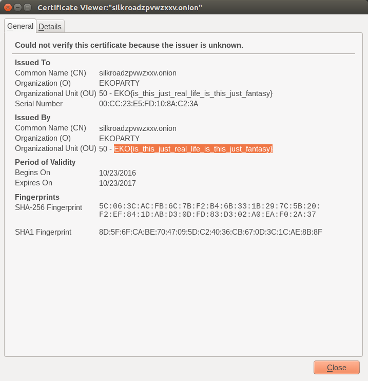

__fbi50 :: Metadata__
===========================

> Help me to find some metadata!

> https://silkroadzpvwzxxv.onion

-----------------------------------

Moving on from the previous FBI challenge, we can now navigate to that domain with the [Tor Browser].

I tried interacting with the login, but I didn't have any credentials that would work and apparently the functionality to sign up was no longer available. Whatever. I poked around.

I saw that the page was using [HTTPS], so on a whim, I decided to look more closely at the certificates, since that could be supposedly considered "metadata", I guess.

I did this by clicking on the information bubble beside the back button on the [Tor Browser]. I was able to select the certificate for the page, and after the `Page Info` dialog popped up, I selected `View Certificate`.

Apparently that was the right hunch -- I found the flag!

Flag found to be __`EKO{is_this_just_real_life_is_this_just_fantasy}`__

[CTF]: https://en.wikipedia.org/wiki/Capture_the_flag#Computer_security
[Cyberstakes]: https://cyberstakesonline.com/
[OverTheWire]: http://overthewire.org/
[ctftime.org]: http://ctftime.org
[SECCON 2015 Online CTF]: https://ctftime.org/event/274
[SECCON]: http://ctf.seccon.jp/
[32C3 CTF]: https://ctftime.org/event/278
[32C3]: https://32c3ctf.ccc.ac/
[EKOPARTY 2016 CTF]: https://ctftime.org/event/342
[robots.txt]: http://www.robotstxt.org/
[URL]: https://en.wikipedia.org/wiki/Uniform_Resource_Locator
[nikto]: http://sectools.org/tool/nikto/
[Netcraft]: https://www.netcraft.com/
[CSS]: https://en.wikipedia.org/wiki/Cascading_Style_Sheets
[Tor Browser]: https://www.torproject.org/projects/torbrowser.html.en
[Tor]: https://www.torproject.org/projects/torbrowser.html.en
[64-bit]: https://en.wikipedia.org/wiki/64-bit_computing
[Linux]: https://en.wikipedia.org/wiki/Linux
[HTML]: https://en.wikipedia.org/wiki/HTML
[HTTPS]: https://en.wikipedia.org/wiki/HTTPS