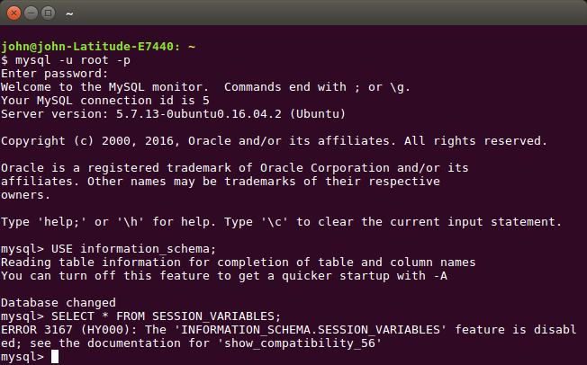

__web100 :: Super duper advanced attack__
===========================

> Can you find the flag?
> 
> [http://0491e9f58d3c2196a6e1943adef9a9ab734ff5c9.ctf.site:20000](http://0491e9f58d3c2196a6e1943adef9a9ab734ff5c9.ctf.site:20000)
>
> Hint
> You don't need to search for the flag outside the DB, there is more than tables and columns in a DB. 

-----------------------------------

I did NOT solve this challenge during the competition, and I am upset about it. After reading all of the writeups that were released after the [CTF], I am not the only one who did not like this challenge -- the difficulty here was not exploiting the vulnerability, but _guessing_ where the flag was.

I was able to exploit the vulnerability just fine; it was some [SQL injection].

The top right search field was your input, and you could use it to filter out usernames that were listed. To test, I entered just the character `m`, to get names that had an `m` in the name.

That returned about three results, so it was working as expected. Now if I tacked in a single quote `'` to throw in some plausible [SQL] stuff, I can see it break.

This may or not be [SQL injection], so I tried to test it with a comment following. I sent in a single quote and a pound symbol, a common [SQL] comment. That returned everything like it had before, when no filter was applied. Awesome  -- now I know I am entereding real [SQL injection].

I poked a bit with the [UNION] statment to see if I could tack on any extra queries. That is a common [SQL injection] technique, when you know you are dealing with a [SELECT] statement -- you can use [UNION] to execute a whole nother query, as long as you can find the correct number of columns needed (the same number that is being returned in the original query).

I tested a bit with simple numbers: first, `' UNION SELECT 1 #` and then second `' UNION SELECT 1, 2 #` and that second one worked -- it was returning two fields, and the number `2` field was what would populate the usernames.

Now, I could leak the entire database, if I wanted to. I tried to put together a small document that has syntax for stuff like this here: [https://github.com/USCGA/miscellaneous/blob/master/SQL_INJECTION_CHEATSHEET.md](https://github.com/USCGA/miscellaneous/blob/master/SQL_INJECTION_CHEATSHEET.md)


I poked around, looking at the `users` table that has all the usernames and their password hashes and their IDs and stuff and even looking at things in the `information_schema` database and all.

[I even did write something to automate leaking _the entire database_](leak_database.py), just to see if I could maybe [`grep`][grep] for the flag.


But that didn't find it.

After the competition was over, I read some writeups and apparently people got it by finding a [session variable], called `@flag`.

To get the flag, all you really need is the injection `' UNION SELECT 1, @flag #`.

```
EKO{do_not_forget_session_variables} 
```

So why didn't I find it when I leaked everything?
------------

In the `information_schema` database, there is a table for [session variables]. Apparently you can't usually read that with a [SELECT] statement, though -- I even tried on my local box.




[CTF]: https://en.wikipedia.org/wiki/Capture_the_flag#Computer_security
[Cyberstakes]: https://cyberstakesonline.com/
[OverTheWire]: http://overthewire.org/
[ctftime.org]: http://ctftime.org
[SECCON 2015 Online CTF]: https://ctftime.org/event/274
[SECCON]: http://ctf.seccon.jp/
[32C3 CTF]: https://ctftime.org/event/278
[32C3]: https://32c3ctf.ccc.ac/
[EKOPARTY 2016 CTF]: https://ctftime.org/event/342
[robots.txt]: http://www.robotstxt.org/
[URL]: https://en.wikipedia.org/wiki/Uniform_Resource_Locator
[nikto]: http://sectools.org/tool/nikto/
[Netcraft]: https://www.netcraft.com/
[SQL injection]: https://en.wikipedia.org/wiki/SQL_injection
[SQL]: https://en.wikipedia.org/wiki/SQL
[UNION]: http://www.w3schools.com/sql/sql_union.asp
[SELECT]: https://www.tutorialspoint.com/sql/sql-select-query.htm
[grep]: https://www.gnu.org/software/grep/manual/grep.html
[session variable]: http://www.sqlines.com/mysql/session_variables
[session variables]: http://www.sqlines.com/mysql/session_variables