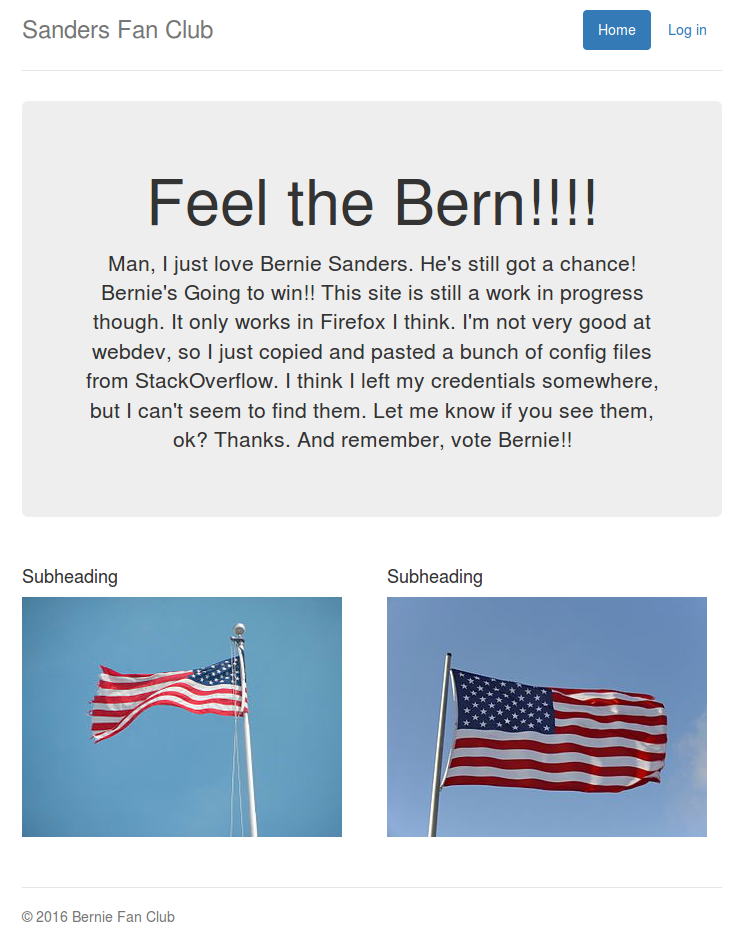
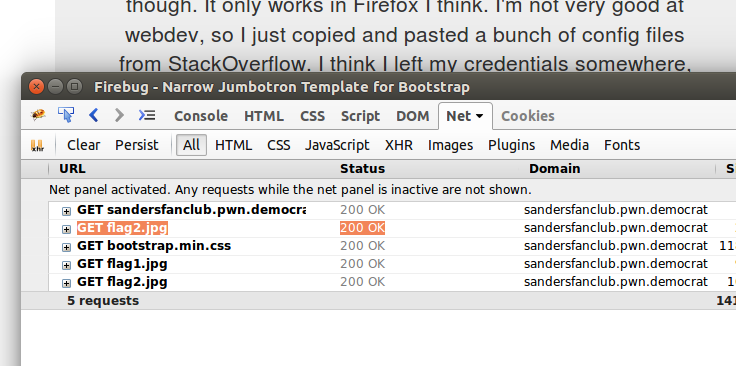
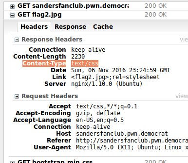

__web100 :: Sander's Fan Club__
===========================

_John Hammond_ | _Sunday, November 6th, 2016_

> Those deplorable Sanders supporters are still fighting. Shut the site down by finding where the idiot stored his credentials.
>
> [http://sandersfanclub.pwn.democrat](http://sandersfanclub.pwn.democrat)
>
> author's irc nick: Lense

-----------------------------------

The challenge prompt explains that we need to find credentials.

They gave us a [URL], so I went ahead and navigated to it. 



It had a simple webpage, with a description giving us some clues: "This site is still a work in progress. It only works in Firefox I think. I'm not very good at webdev, so I just copied and pasted a bunch of config files from StackOverflow."

Thankfully I am running [Firefox], so I guess I was good -- I tried to look at the website in other browsers like [Chromium], but I couldn't see any outright changes. 

I tried [Googling] around [Stack Overflow] for common or example config files for things like [Bootstrap] or web server/development stuff, but didn't have any luck with that.

I tried the low-hanging fruit, like scanning it with [Netcraft] or checking for a [`robots.txt`][robots.txt] file. When I tried the [`robots.txt`][robots.txt] file I got a [404] which tipped off that the web server was using [nginx]. That help me try and narrow down the scope for the [Stack Overflow] searches, but that was a rabbit hole anyway. 

After lurking around the [IRC] channel for a good while, the admin confirmed that the flag _was_ on the website itself, you didn't have to go digging through [Stack Overflow].  

While I was going through the low-hanging fruit checklist I had ran [`nikto`][nikto], and that had a peculiar result.

```
$ nikto -h "http://sandersfanclub.pwn.democrat/"
- Nikto v2.1.5
---------------------------------------------------------------------------
+ Target IP:          52.205.233.191
+ Target Hostname:    sandersfanclub.pwn.democrat
+ Target Port:        80
+ Start Time:         2016-11-06 18:34:30 (GMT-5)
---------------------------------------------------------------------------
+ Server: nginx/1.10.0 (Ubuntu)
+ Server leaks inodes via ETags, header found with file /, fields: 0x581a7f27 0x79f 
+ The anti-clickjacking X-Frame-Options header is not present.
+ Uncommon header 'link' found, with contents: <flag2.jpg>;rel=stylesheet
```

That last line, `Uncommon header 'link' found, with contents: <flag2.jpg>;rel=stylesheet` was really weird, I had never seen that before. It apparently had some weird beef with the `flag2.jpg` file. Admittedly, I should have [Googled] more about this "Link" header because I'm sure that would have led me to a solution much faster... but I had just breezed right by it. I just noted that the `flag2.jpg` was weird for some reason.

-------------


Back on the website I tried some more poking around, looking at [HTML] source and what the page really does. The "Login" page is just a simple password input text box, but according to the source it was just some [JavaScript] that tells me that the flag is the password.

Since I was exploring the [HTML] and the source, I was using [Firebug], the [Firefox] plugin to help debug and troubleshoot [HTML] and [JavaScript] and stuff. At one point I was reviewing the network traffic (the [HTTP][HTTP] [GET] methods and all), and I saw something really odd.



It looked like the `flag2.jpg` image was being retried _twice_... once early, and once again, with the other `flag1.jpg` image. Super weird, right?

I took a look at the first [GET] in [Firebug].



It looked like it was being received with the [Content-Type] header being set to `text/css`. __Wtf?__ A [JPG] image is not a [CSS] stylesheet. I right clicked on it and copied the [`curl`][curl] command, to see how it is done in raw text.

```
$ curl 'http://sandersfanclub.pwn.democrat/flag2.jpg' -H 'Accept: text/css,*/*;q=0.1' -H 'Accept-Encoding: gzip, deflate' -H 'Accept-Language: en-US,en;q=0.5' -H 'Connection: keep-alive' -H 'Host: sandersfanclub.pwn.democrat' -H 'Referer: http://sandersfanclub.pwn.democrat/' -H 'User-Agent: Mozilla/5.0 (X11; Ubuntu; Linux x86_64; rv:49.0) Gecko/20100101 Firefox/49.0'
```

At the end of the output, we can see this [CSS] comment...

```
/* 
 * How did I... Nevermind. I'm pretty sure my creds are in a text file
 */
```

Aha! That's a lead, we must be doing _something_ right. 

So now we need a text file? I poked around, trying files like `flag2.txt` or other nonsense like that.... but eventually, I realized:

if the [Content-Type] header was originally a `text/css` file, which was weird to begin with, what would it be as a raw and plain text file, with the [Content-Type] as `text/plain`? 

We changed this with the `Accept:` header that we can see in the [`curl`][curl] command.

```
$ curl 'http://sandersfanclub.pwn.democrat/flag2.jpg' -H 'Accept: text/plain,*/*;q=0.1' -H 'Accept-Encoding: gzip, deflate' -H 'Accept-Language: en-US,en;q=0.5' -H 'Connection: keep-alive' -H 'Host: sandersfanclub.pwn.democrat' -H 'Referer: http://sandersfanclub.pwn.democrat/' -H 'User-Agent: Mozilla/5.0 (X11; Ubuntu; Linux x86_64; rv:49.0) Gecko/20100101 Firefox/49.0'
```

And we get:

```
Password reminder: flag{I_am_very_bad_with_computers}
(Go tell chrome devs to support RFC 5988 
Firefox masterrace)
```

There is our flag! __`flag{I_am_very_bad_with_computers}`__

The note here mentions [RFC 5988], which apparently adds support for that "Link" header that [`nikto`][nikto] found and what I guess allows this functionality to happen, sending a `flag2.jpg` [JPG] image as something else, like a [CSS] stylesheet.

If I had [Googled] that message from [`nikto`][nikto] earlier, I may have been able to solve this sooner. Regardless, a flag is a flag!


[CTF]: https://en.wikipedia.org/wiki/Capture_the_flag#Computer_security
[Cyberstakes]: https://cyberstakesonline.com/
[OverTheWire]: http://overthewire.org/
[ctftime.org]: http://ctftime.org
[SECCON 2015 Online CTF]: https://ctftime.org/event/274
[SECCON]: http://ctf.seccon.jp/
[32C3 CTF]: https://ctftime.org/event/278
[32C3]: https://32c3ctf.ccc.ac/
[EKOPARTY 2016 CTF]: https://ctftime.org/event/342
[robots.txt]: http://www.robotstxt.org/
[URL]: https://en.wikipedia.org/wiki/Uniform_Resource_Locator
[nikto]: http://sectools.org/tool/nikto/
[Netcraft]: https://www.netcraft.com/
[CSS]: https://en.wikipedia.org/wiki/Cascading_Style_Sheets
[Tor Browser]: https://www.torproject.org/projects/torbrowser.html.en
[Tor]: https://www.torproject.org/projects/torbrowser.html.en
[64-bit]: https://en.wikipedia.org/wiki/64-bit_computing
[Linux]: https://en.wikipedia.org/wiki/Linux
[HTML]: https://en.wikipedia.org/wiki/HTML
[Firefox]: https://www.mozilla.org/en-US/firefox/new/
[Chromium]: https://en.wikipedia.org/wiki/Chromium_(web_browser)
[Google]: https://www.google.com/
[Googled]: https://www.google.com/
[Googling]: https://www.google.com/
[Stack Overflow]: http://stackoverflow.com/
[Bootstrap]: http://getbootstrap.com/
[404]: https://en.wikipedia.org/wiki/HTTP_404
[nginx]: https://www.nginx.com/
[IRC]:https://en.wikipedia.org/wiki/Internet_Relay_Chat
[javascript]: https://en.wikipedia.org/wiki/JavaScript
[Firebug]: http://getfirebug.com/
[HTTP]: https://en.wikipedia.org/wiki/Hypertext_Transfer_Protocol
[GET]: http://www.w3schools.com/TAgs/ref_httpmethods.asp
[Content-Type]: https://www.w3.org/Protocols/rfc1341/4_Content-Type.html
[JPEG]: https://en.wikipedia.org/wiki/JPEG
[JPG]: https://en.wikipedia.org/wiki/JPEG
[CSS]: https://en.wikipedia.org/wiki/Cascading_Style_Sheets
[curl]: https://curl.haxx.se/
[RFC 5988]: https://tools.ietf.org/html/rfc5988