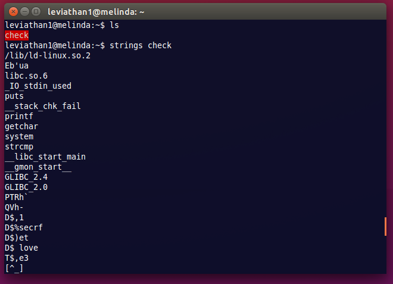
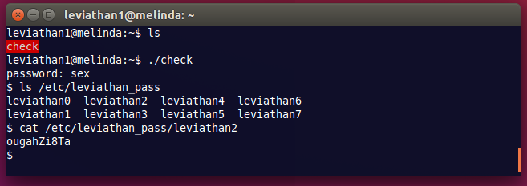

__Leviathan :: Level 1__
================


_John Hammond_ | _Tuesday, November 3rd, 2015_ 


> There is no information for this level, intentionally.


----------


Start by [`ssh`][ssh]ing into the level. Supply the password you retrieved in the previous level. 

```
ssh leviathan1@leviathan.labs.overthewire.org
```

If you run the [`ls`][ls] command, you'll see there is just one file `check`. 
If we try and run the program, all it does is ask for a password. If we enter something other than the correct password, it just says "wrong password" and exits.

So we've got to analyze this thing.

Let's start small: we could use [`strings`][strings] to see all the plain text strings in the binary. When I did this, I didn't really find anything interesting.



What other tools can we use? Well, there is [`ltrace`][ltrace]. When we run this, it's pretty clear to see what the program is doing..

```
leviathan1@melinda:~$ ltrace ./check 
__libc_start_main(0x804852d, 1, 0xffffd7a4, 0x80485f0 <unfinished ...>
printf("password: ")                             = 10
getchar(0x8048680, 47, 0x804a000, 0x8048642password: anything
)     = 97
getchar(0x8048680, 47, 0x804a000, 0x8048642)     = 110
getchar(0x8048680, 47, 0x804a000, 0x8048642)     = 121
strcmp("any", "sex")                             = -1
puts("Wrong password, Good Bye ..."Wrong password, Good Bye ...
)             = 29
+++ exited (status 0) +++
```

You can follow through some [C] code to see it runs the [`strcmp`][strcmp] function to test for the password. It looks like it is comparing the first three letters of what we to "sex". 

I guess "sex" is the password.

If you enter that, it does give you a shell. From that shell, you can find the password for the next level!



__The password for leviathan2 is `ougahZi8Ta`.__

[netcat]: https://en.wikipedia.org/wiki/Netcat
[Wikipedia]: https://www.wikipedia.org/
[Linux]: https://www.linux.com/
[man page]: https://en.wikipedia.org/wiki/Man_page
[PuTTY]: http://www.putty.org/
[ssh]: https://en.wikipedia.org/wiki/Secure_Shell
[Windows]: http://www.microsoft.com/en-us/windows
[virtual machine]: https://en.wikipedia.org/wiki/Virtual_machine
[operating system]:https://en.wikipedia.org/wiki/Operating_system
[OS]: https://en.wikipedia.org/wiki/Operating_system
[VMWare]: http://www.vmware.com/
[VirtualBox]: https://www.virtualbox.org/
[hostname]: https://en.wikipedia.org/wiki/Hostname
[port number]: https://en.wikipedia.org/wiki/Port_%28computer_networking%29
[distribution]:https://en.wikipedia.org/wiki/Linux_distribution
[Ubuntu]: http://www.ubuntu.com/
[ISO]: https://en.wikipedia.org/wiki/ISO_image
[standard streams]: https://en.wikipedia.org/wiki/Standard_streams
[read]: http://ss64.com/bash/read.html
[variable]: https://en.wikipedia.org/wiki/Variable_%28computer_science%29
[command substitution]: http://www.tldp.org/LDP/abs/html/commandsub.html
[permissions]: https://en.wikipedia.org/wiki/File_system_permissions
[redirection]: http://www.tldp.org/LDP/abs/html/io-redirection.html
[tmp]: http://www.tldp.org/LDP/Linux-Filesystem-Hierarchy/html/tmp.html
[curl]: http://curl.haxx.se/
[cl1p.net]: https://cl1p.net/
[request]: http://www.w3.org/Protocols/rfc2616/rfc2616-sec5.html
[POST request]: https://en.wikipedia.org/wiki/POST_%28HTTP%29
[Python]: http://python.org/
[interpreter]: https://en.wikipedia.org/wiki/List_of_command-line_interpreters
[requests]: http://docs.python-requests.org/en/latest/
[urllib]: https://docs.python.org/2/library/urllib.html
[file handling with Python]: https://docs.python.org/2/tutorial/inputoutput.html#reading-and-writing-files
[bash]: https://www.gnu.org/software/bash/
[Assembly]: https://en.wikipedia.org/wiki/Assembly_language
[the stack]:  https://en.wikipedia.org/wiki/Stack_%28abstract_data_type%29
[register]: http://www.tutorialspoint.com/assembly_programming/assembly_registers.htm
[hex]: https://en.wikipedia.org/wiki/Hexadecimal
[archive file]: https://en.wikipedia.org/wiki/Archive_file
[zip file]: https://en.wikipedia.org/wiki/Zip_%28file_format%29
[gigabytes]: https://en.wikipedia.org/wiki/Gigabyte
[GB]: https://en.wikipedia.org/wiki/Gigabyte
[GUI]: https://en.wikipedia.org/wiki/Graphical_user_interface
[Wireshark]: https://www.wireshark.org/
[FTP]: https://en.wikipedia.org/wiki/File_Transfer_Protocol
[client and server]: https://simple.wikipedia.org/wiki/Client-server
[RETR]: http://cr.yp.to/ftp/retr.html
[FTP server]: https://help.ubuntu.com/lts/serverguide/ftp-server.html
[SFTP]: https://en.wikipedia.org/wiki/SSH_File_Transfer_Protocol
[SSL]: https://en.wikipedia.org/wiki/Transport_Layer_Security
[encryption]: https://en.wikipedia.org/wiki/Encryption
[HTML]: https://en.wikipedia.org/wiki/HTML
[Flask]: http://flask.pocoo.org/
[SQL]: https://en.wikipedia.org/wiki/SQL
[and]: https://en.wikipedia.org/wiki/Logical_conjunction
[Cyberstakes]: https://cyberstakesonline.com/
[cat]: https://en.wikipedia.org/wiki/Cat_%28Unix%29
[symbolic link]: https://en.wikipedia.org/wiki/Symbolic_link
[ln]: https://en.wikipedia.org/wiki/Ln_%28Unix%29
[absolute path]: https://en.wikipedia.org/wiki/Path_%28computing%29
[CTF]: https://en.wikipedia.org/wiki/Capture_the_flag#Computer_security
[Cyberstakes]: https://cyberstakesonline.com/
[OverTheWire]: http://overthewire.org/
[Leviathan]: http://overthewire.org/wargames/leviathan/
[ls]: https://en.wikipedia.org/wiki/Ls
[grep]: https://en.wikipedia.org/wiki/Grep
[strings]: http://linux.die.net/man/1/strings
[ltrace]: http://linux.die.net/man/1/ltrace
[C]: https://en.wikipedia.org/wiki/C_%28programming_language%29
[strcmp]: http://linux.die.net/man/3/strcmp