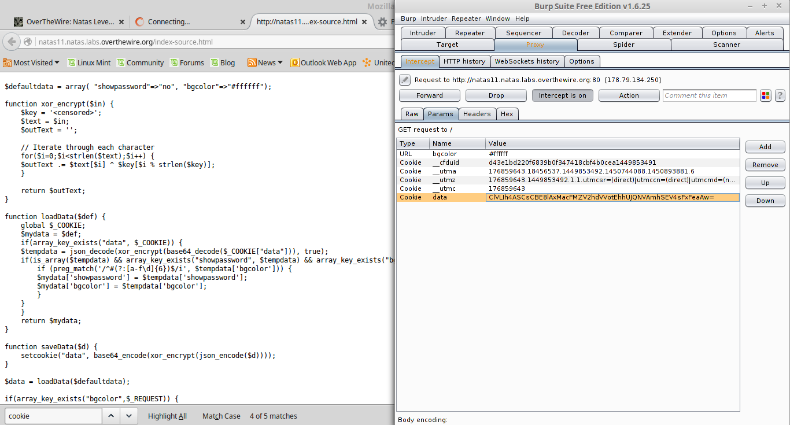
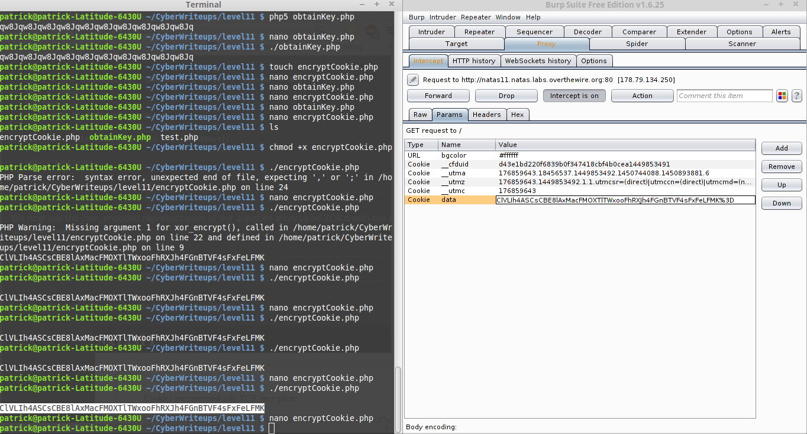

__Natas :: Level 11__
================


_Patrick Ledzian_ | _Monday, December 23rd, 2015_ 


> There is no information for this level, intentionally.


----------

Start by using a web browser to navigate to the website `http://natas11.natas.labs.overthewire.org/`

```
Login: natas11

Password: U82q5TCMMQ9xuFoI3dYX61s7OZD9JKoK

```

When you open the webpage you should see a familiar sight. Look at the source code

This is by far the most complex source code we have seen in natas; be patient and we'll slog through it

The challenge stated that the cookie is encrypted with XOR encryption 

Look at the source code (best to have this tutorial and the code side by side)

We are given the default cookie values --> $defaultdata

We are also give the function xor_encrypt

Lastly, the function saveData shows how the cookie data is changed before being used in the packet

Read through the code, look up syntax you don't know, this is important

You need to know how XOR encryption works in a nutshell [more info]
	
```

     originalCookie XOR key = encryptedCookie
     originalCookie XOR encryptedCookie = key

```

Now use Burp to obtain the data cookie so we can reverse it



Now we must obtain the encryption key, I used php because I reused the xor_encrypt function code

```

#!/usr/bin/php5
<?php
// here we want to find the XOR key used to encrypt the cookie
// how the encryption works:
//      originalCookie XOR key = encryptedCookie
//      originalCookie XOR encryptedCookie = key

$originalCookie = base64_decode('ClVLIh4ASCsCBE8lAxMacFMZV2hdVVotEhhUJQNVAmhSEV4sFxFeLFMK%3D')

function xor_encrypt($in) {
    $key = json_encode(array("showpassword"=>"no", "bgcolor"=>"#ffffff"));//from d$
    $text = $in;
    $outText = ''; // this will take on the value of the XOR key (just trying to r$

    // Iterate through each character
    for($i=0;$i<strlen($text);$i++) {
    $outText .= $text[$i] ^ $key[$i % strlen($key)];
    }

    return $outText;
}

echo xor_encrypt("$originalCookie");
echo "\n";

?>

```

We found the key to be `qw8Jqw8Jqw8Jqw8Jqw8Jqw8Jqw8Jqw8Jqw8Jqw8Jq` but notice that it is repeating in groups of 4 characters.

The key is actually the four character group `qw8J`

Now we use that key to encrypt our own data that will show us the password

`"showpassword"=>"yes", "bgcolor"=>"#ffffff"`

The following code produces new data for the data parameter in the packet to be sent

```

#!/usr/bin/php5

<?php
// here we want to encrypt our own cookie using the key we found "qw8J"
// how the encryption works:
//      originalCookie XOR key = encryptedCookie
//      originalCookie XOR encryptedCookie = key

function xor_encrypt() { // no argument needed
    $key = "qw8J";
    $text = json_encode(array( "showpassword"=>"yes", "bgcolor"=>"#ffffff"));
    $outText = ''; // this will become the encrypted cookie

    // Iterate through each character
    for($i=0;$i<strlen($text);$i++) {
    $outText .= $text[$i] ^ $key[$i % strlen($key)];
    }

    return $outText;
}

print base64_encode(xor_encrypt()); // the data needs to be b64 encoded for the pa$
echo " \n";

```

Run this and you will get the new data value of:

`ClVLIh4ASCsCBE8lAxMacFMOXTlTWxooFhRXJh4FGnBTVF4sFxFeLFMK`

Pass this through the packet to get the password for natas12 



The password for natas12 is EDXp0pS26wLKHZy1rDBPUZk0RKfLGIR3


[more info]: http://crypto.stackexchange.com/questions/19470/how-is-xor-used-for-encryption
