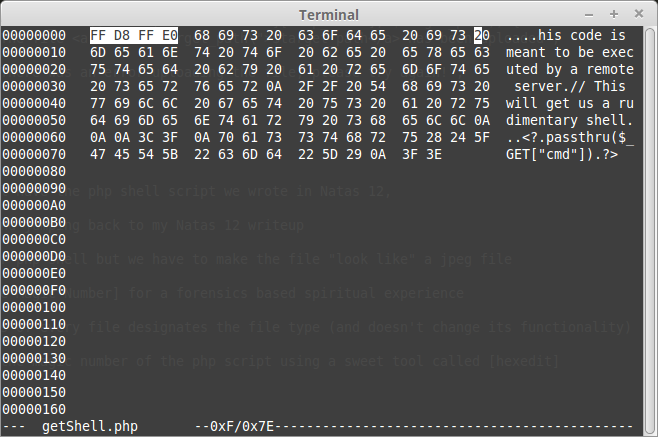

__Natas :: Level 13__
================


_Patrick Ledzian_ | _Friday, January 22th, 2016_ 


> There is no information for this level, intentionally.

----------

Start by using a web browser to navigate to the website `http://natas13.natas.labs.overthewire.org/`

```
Login: natas13

Password: jmLTY0qiPZBbaKc9341cqPQZBJv7MQbY

```

Open the web page and you will see a file upload, same thing as the last problem? Nope.

You have to upload a JPEG file, however this time the website enforces this rule.

You can see this if you open the source code

```

if(array_key_exists("filename", $_POST)) {
    $target_path = makeRandomPathFromFilename("upload", $_POST["filename"]);


        if(filesize($_FILES['uploadedfile']['tmp_name']) > 1000) {
        echo "File is too big";
    } else if (! exif_imagetype($_FILES['uploadedfile']['tmp_name'])) {
        echo "File is not an image";
    } else {
        if(move_uploaded_file($_FILES['uploadedfile']['tmp_name'], $target_path)) {
            echo "The file <a href=\"$target_path\">$target_path</a> has been uploaded";
        } else{
            echo "There was an error uploading the file, please try again!";
        }
    }
} else { 

```

Hopefully you still have the php shell script we wrote in Natas 13, 

If not I'd recommend jumping back to my Natas 13 writeup

Here we can use our php shell but we have to make the file "look like" a jpeg file

Take a trip to [The Magic Number] for a forensics based spiritual experience

The first 2-4 bytes of every file designates the file type (and doesn't change its functionality)

We need to change the magic number of the php script using a sweet tool called [hexedit]

Find the jpg [File Signature]



Change the first 4 bytes of hex, shown above

Upload the file, use burp to change the file extension to .php (all the same steps as in the Natas 13 writeup)

Navigate to the link: 

`http://natas13.natas.labs.overthewire.org/upload/2ng12i2nk9.php?cmd=cat%20/etc/natas_webpass/natas14`

The password for natas14 is Lg96M10TdfaPyVBkJdjymbllQ5L6qdl1


[The Magic Number]: https://en.wikipedia.org/wiki/File_format#Magic_number
[hexedit]: http://linux.die.net/man/1/hexedit
[File Signatures]: http://www.filesignatures.net/index.php?search=jpg&mode=EXT

