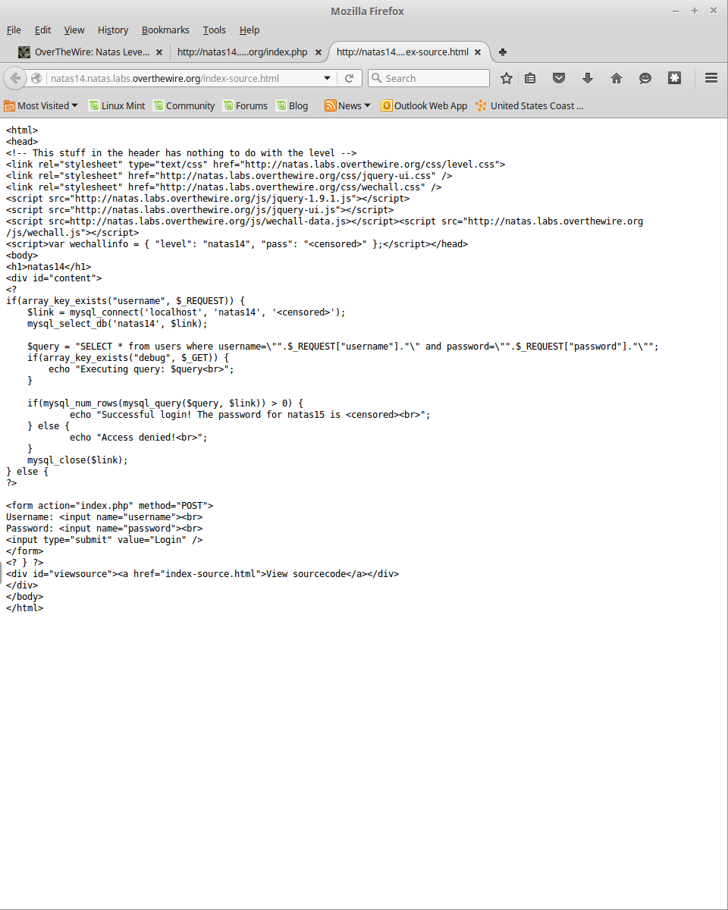

__Natas :: Level 14__
================


_Patrick Ledzian_ | _Saturday, January 23rd, 2016_ 


> There is no information for this level, intentionally.

----------

Start by using a web browser to navigate to the website `http://natas14.natas.labs.overthewire.org/`

```
Login: natas14

Password: Lg96M10TdfaPyVBkJdjymbllQ5L6qdl1

```

Upon login you will see another login and a link to source code

Look at the source code 



It becomes apparent that they are running a SQL database for the login (albiet very poorly)

Time to learn about [SQL Injection]

It turns out that the php code that interfaces with the SQL database does not escape the login parameters correctly

` "SELECT * from users where username=\"".$_REQUEST["username"]."\" and password=\"".$_REQUEST["password"]."\"" `

Whatever you put in the username and password field will appear in place of `.$_REQUEST["username"].` and `.$_REQUEST["password"].`

We can terminate the input field with `"` and then put in whatever SQL code we want to interface with the database

Lets try `" OR "1"="1` in both fields, this passes "True" for the login checking for the SQL database

The password for natas15 is AwWj0w5cvxrZiONgZ9J5stNVkmxdk39J

Read more about SQL injections [Link1] and [Link2] they are a HUGE and common vulnerability in the real world


[SQL Injection]: http://null-byte.wonderhowto.com/how-to/essential-newbies-guide-sql-injections-and-manipulating-data-mysql-database-0133921/

[link1]: http://null-byte.wonderhowto.com/how-to/hacking-web-apps/
[link2]: http://null-byte.wonderhowto.com/how-to/db-hacking/


