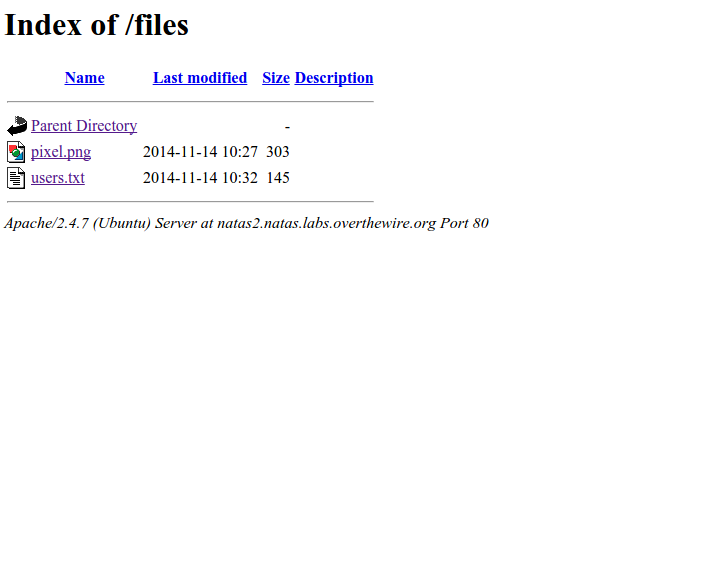

__Natas :: Level 2__
================


_Patrick Ledzian_ | _Thursday, December 10th, 2015_ 


> There is no information for this level, intentionally.


----------


Start by using a web browser to navigate to the website `http://natas2.natas.labs.overthewire.org/`

```
Login: natas2

Password: ZluruAthQk7Q2MqmDeTiUij2ZvWy2mBi

```

You will see: "There is nothing on this page "

Riiiiiight...... Like I'm going to believe that.

`crtl + u`

No key...

Welp. Lets try `Right Click --> Inspect Element`

Nope, again no key.

*./tears*

However, if we go back to the html viewer `ctrl + u` we will see something suspicious.


Line 15 shows a path on the website.

Lets try running the url `http://natas2.natas.labs.overthewire.org/files/`

What you see are the files under the [/files] path.



Click on `users.txt` and find the flag!

natas3: sJIJNW6ucpu6HPZ1ZAchaDtwd7oGrD14


[/files]: http://stackoverflow.com/questions/4010158/is-it-possible-to-get-a-list-of-files-under-a-directory-of-a-website-how
