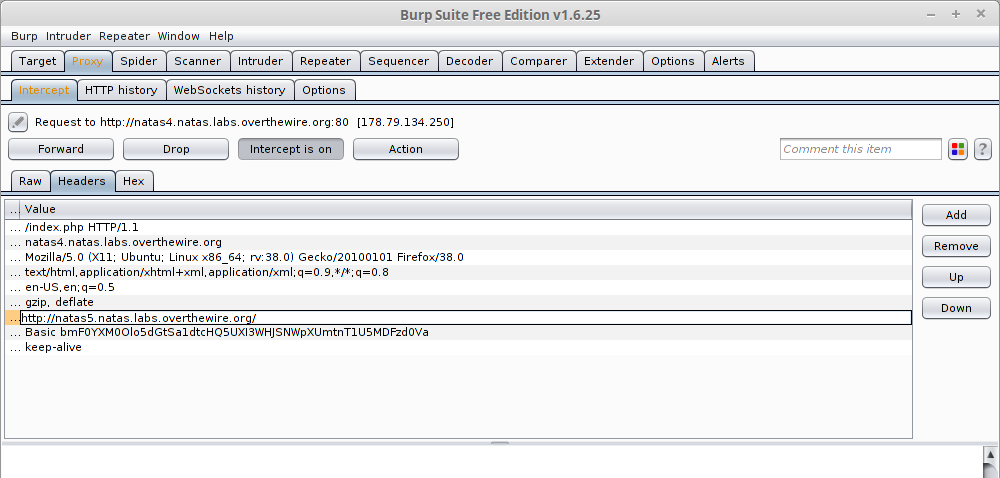

__Natas :: Level 4__
================


_Patrick Ledzian_ | _Thursday, December 10th, 2015_ 


> There is no information for this level, intentionally.


----------


Start by using a web browser to navigate to the website `http://natas4.natas.labs.overthewire.org/`

```
Login: natas4

Password: Z9tkRkWmpt9Qr7XrR5jWRkgOU901swEZ

```

Upon loading the page you will see a text banner reading "Access disallowed. You are visiting from " while authorized users should come only from 
"http://natas5.natas.labs.overthewire.org/"

We can look at the source code using `ctrl + u` but it does not contain anything interesting

If we refer again to the text banner we notice that "authorized users" should be coming from http://natas5.natas.labs.overthewire.org/

A common technique in CTF web challenges is [packet manipulation]

To manipulate a packet we have to intercept it first. My tool of choice is [Burp Suite].

Open Burp Suite 

Burp is analyzing traffic that runs across port 8080 (by default) on your computer

We need to configure a proxy for our web browser that will force our traffic to run through port 8080

In firefox click on the options button in the upper right corner of your browser

Preferences --> Advanced --> (Under Network Tab) Settings --> Manual Proxy Configuration


Now go back to your Burp window and click intercept to mode `intercept on`

Then go back to the natas4 website and refresh the page

Burp suite should pop up

Edit the Referer by double clicking on the second field with value "natas4.natas.labs.overthewire.org"



Change the field natas5.natas.labs.overthewire.org and foward the packet

Out pops the key!

Access granted. The password for natas5 is iX6IOfmpN7AYOQGPwtn3fXpbaJVJcHfq 


(don't forget to turn off your proxy)

[packet manipulation]: http://computer.howstuffworks.com/question5251.htm
[Burp Suite]: https://portswigger.net/burp/
