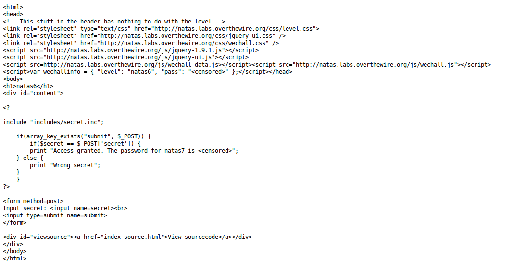

__Natas :: Level 6__
================


_Patrick Ledzian_ | _Monday, December 21st, 2015_ 


> There is no information for this level, intentionally.


----------


Start by using a web browser to navigate to the website `http://natas6.natas.labs.overthewire.org/`

```
Login: natas6

Password: aGoY4q2Dc6MgDq4oL4YtoKtyAg9PeHa1

```

When you navigate to the page you will see an input box that says "Input Secret:"

If you examine the html source you will find there is nothing of value

However, the problem is generous enough to supply the source code that is running the secret input

Click on `View sourcecode`



In the source code you see the html header, and below it you see a php script (php is a scripting/coding language)

The actual code itself conceals any passwords being used, but at the top of the script is an include that looks like it could be a path on the website

Naviagte to the URL `http://natas6.natas.labs.overthewire.org/includes/secret.inc`

The page is blank, well this is pretty useless? Not entirely. If the webpage was down or didn't exist there would be a message saying so. This leads us to believe that something is hidden on the page.

`ctrl + u`

This reveals the html code which is concealing the secret key!

But we're not done yet

Go back to the natas6 page, input the secret key and get the password to level 7!

`The password for natas7 is 7z3hEENjQtflzgnT29q7wAvMNfZdh0i9` 

