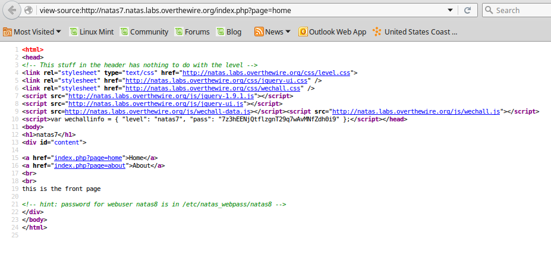

__Natas :: Level 7__
================


_Patrick Ledzian_ | _Monday, December 21st, 2015_ 


> There is no information for this level, intentionally.


----------


Start by using a web browser to navigate to the website `http://natas7.natas.labs.overthewire.org/`

```
Login: natas7

Password: 7z3hEENjQtflzgnT29q7wAvMNfZdh0i9

```

When you load this page you are greeted with two links, Home and About. 

Navigate to both of them, they are both outwardly the same.

Check the html source and you'll see a great clue on line 21

<!-- hint: password for webuser natas8 is in /etc/natas_webpass/natas8 -->



Now we can try naviagting to this path in the URL

`http://natas7.natas.labs.overthewire.org/etc/natas_webpass/natas8`

We get a not found error

Go back to the original natas7 page and look at the URL

The part of the URL `/index.php?page=home` introduces a new and very common exploit for webpages

These exploits are called Local File Inclusion or Remote File Inclusion ([LFI/RFI]) these are important so at the very least read the linked article

Run the following URL `http://natas7.natas.labs.overthewire.org/index.php?page=/etc/natas_webpass/natas8`

You navigate to the /etc/natas_webpass/natas8 path which contains the key

natas8: DBfUBfqQG69KvJvJ1iAbMoIpwSNQ9bWe 


[LFI/RFI]: http://www.hackchallenge.net/pdf/Finding_LFI_and_RFI.pdf
