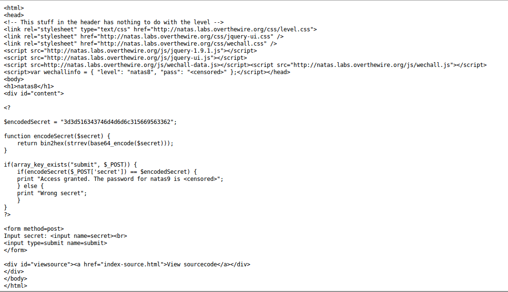

__Natas :: Level 8__
================


_Patrick Ledzian_ | _Monday, December 21st, 2015_ 


> There is no information for this level, intentionally.


----------


Start by using a web browser to navigate to the website `http://natas8.natas.labs.overthewire.org/`

```
Login: natas8

Password: DBfUBfqQG69KvJvJ1iAbMoIpwSNQ9bWe 

```

Load the web page and you'll see an input box. This is the same home page we were greeted with in level 6

Click on the view source code link



By reading through the script in the source code it becomes apparent that what 

ever the user enters is: encoded in [base64], the string is reversed, and finally 

converted from binary into hex. This string is then comapred with the 

encodedSecret string.

[Why base64?]

The fatal flaw in the puzzle is that we are given the encodedSecret which our inputs are compared to

All we need to do is do all of the operations in reverse on the given encodedSecret and we will have our secret string

Since the encoding is done in php I found it easiest to write a reverse script in php

*gasp* 

Yes, it's time to write a script.

The syntax for the script is already contained within the source code for the site

You may have to install php5 with `sudo apt-get install php5-cli`

```

#!/usr/bin/php5

<?php

echo base64_decode(strrev(pack("H*","3d3d516343746d4d6d6c315669563362")))

?>

```

Run the script and you'll get the output: oubWYf2kBq 

On the original site submit this secret key

The password for natas9 is W0mMhUcRRnG8dcghE4qvk3JA9lGt8nDl


[base64]: https://en.wikipedia.org/wiki/Base64
[Why base64?]: http://stackoverflow.com/questions/201479/what-is-base-64-encoding-used-for
