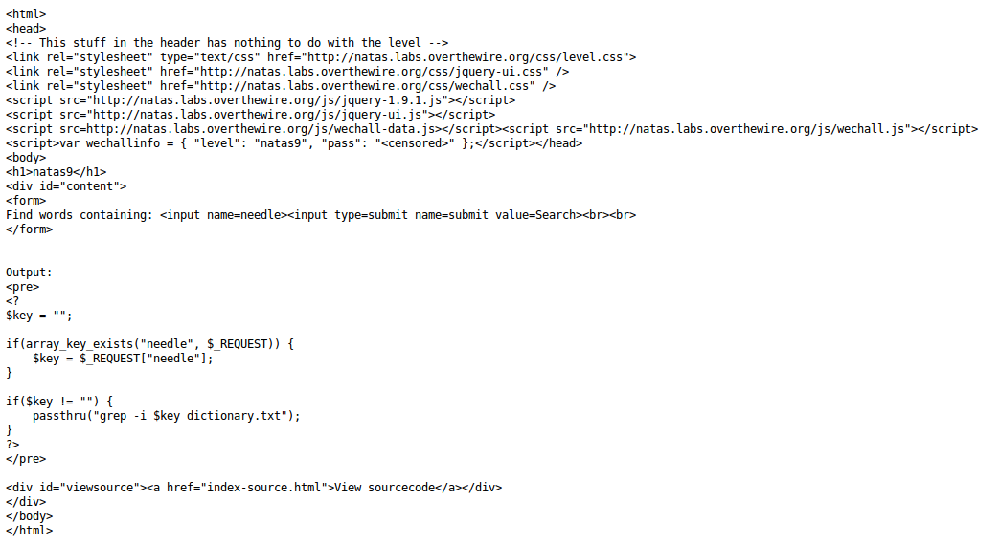

__Natas :: Level 9__
================


_Patrick Ledzian_ | _Monday, December 21st, 2015_ 


> There is no information for this level, intentionally.


----------


Start by using a web browser to navigate to the website `http://natas9.natas.labs.overthewire.org/`

```
Login: natas9

Password: W0mMhUcRRnG8dcghE4qvk3JA9lGt8nDl 

```

Once again we are supplied with an input box and source code



By examining the source code it becomes apparent that the input is not sanitized 
and is open to a [command injection] (read about this, these are common)

Look at the source code, `$key` is where your commands will be inserted

submit the command `blah; cat /etc/natas_webpass/natas10 #`

`blah;` ends the grep call

Remember from earlier problems `/etc/natas_webpass/natas10` is where passwords are stored on this site

Lastly, `#` comments out the dicitonary.txt

natas10: nOpp1igQAkUzaI1GUUjzn1bFVj7xCNzu


[command injection]: https://www.owasp.org/index.php/Command_Injection


