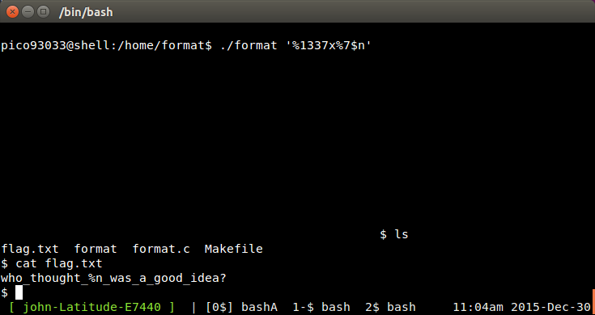

__Format__
================


_John Hammond_ | _Wednesday, December 30th, 2015_ 


> This program is vulnerable to a format string attack! See if you can modify a variable by supplying a format string! The binary can be found at /home/format/ on the shell server. The source can be found here. 


----------


First off, [`ssh`][ssh] into the server so you can poke at the program. Make sure you `cd` into the correct directory, `/home/format`

Take a look at the [source code](format.c).

``` c
#include <stdio.h>
#include <stdlib.h>
#include <fcntl.h>

int secret = 0;

void give_shell(){
    gid_t gid = getegid();
    setresgid(gid, gid, gid);
    system("/bin/sh -i");
}

int main(int argc, char **argv){
    int *ptr = &secret;
    printf(argv[1]);

    if (secret == 1337){
        give_shell();
    }
    return 0;
}
```

Looks like this is another generous program that will give us [shell]; we've just got to hit the sweet spot.

See that call to [`printf`][printf]? Sure you do; it is called without any extra [arguments]... so we've got an easy [Format String Vulnerability].

There are lots of [resources and information][format string] regarding the [format string vulnerability], and it is pretty common for [CTF]s, so I really recommend you learn up on them.

For a real [format string] attack, you'd overwrite some return address to another address call to [`system`][system] and try to give yourself a [shell]. Thankfully this challenge is easy enough that we just have to change one variable.

The source code shows us that we need to get the value of `secret` to `1337` in order to get our shell. So let's mess with the program!

When we run it, our supplied [argument] will be the input to the [`printf`][printf] function, so we can supply any of the [`printf`][printf] format specifiers and peak as to what is on [the stack].

The `%p` argument will show a [hexadecimal] representation... so we can look at addresses in memory!


```
$ ./format '%p'
0xffffd794
```

Don't forget we can have as many of these as we could like, to look at more and more spaces in memory...


```
$ ./format '%p %p %p %p %p %p %p %p %p'
0xffffd784 0xffffd790 0xf7e5242d 0xf7fc93c4 0xf7ffd000 0x804852b 0x804a030 0x8048520 (nil)
```

Well this is all fine and dandy, but we need to know where that `secret` variable lives. We can get its address with [`gdb`][gdb].

```
$ gdb format
(gdb) x &secret
0x804a030 <secret>:     0x00000000
```

Nice! It looks like it's address is `0x804a030`. Did we see that in our output, when we looked up through [the stack]? I see it there!

So I count that spot to be the 7th address we looked at. Now, we want to specify that address and only that address. We can do that again with a [`printf`][printf] [format specifier]. The syntax for that is `%n$x` where _n_ is the number we want, and _x_ is the data identifier (like `p`, that we have been using, or `x` or `s` or any other you might end up using).

Let's get _just_ that address for the `secret` variable.

```
$ ./format '%7$p'
0x804a030
```

Note that because we are using the `$` dollar sign, [`bash`][bash] might try to do some [variable expansion]. __To avoid this, make sure we are using _literal_ strings, with single-quotes!__

Sweet, now that we have narrowed down the address we want to mess with, let's go ahead and change it's value. The [`printf`][printf] [format specifier] `%n` will let you write to an address... and it lets you write _the number of characters used in the [`printf`][printf] string_. I know that's weird, but we can manipulate it really easily. 

[`printf`][printf] allows us to _pad_ our input, so it will have a certain length. Whatever actual data (_not_ [format specifiers]) we supply, and our padding! The syntax for that is `%Nx`, where _N_ is the amount of padding we want to use. 

So, if we supply no additional data and just pad to those `1337` places, our `secret` variable will be written to have the value of `1337`! 

All we have to do is specify the padding, the address we want, and that we want to _writing_ to this address now (rather than reading it with `p`, like we were before).

Try it out!


 
__Submit: `who_thought_%n_was_a_good_idea?`__

[netcat]: https://en.wikipedia.org/wiki/Netcat
[Wikipedia]: https://www.wikipedia.org/
[Linux]: https://www.linux.com/
[man page]: https://en.wikipedia.org/wiki/Man_page
[PuTTY]: http://www.putty.org/
[ssh]: https://en.wikipedia.org/wiki/Secure_Shell
[Windows]: http://www.microsoft.com/en-us/windows
[virtual machine]: https://en.wikipedia.org/wiki/Virtual_machine
[operating system]:https://en.wikipedia.org/wiki/Operating_system
[OS]: https://en.wikipedia.org/wiki/Operating_system
[VMWare]: http://www.vmware.com/
[VirtualBox]: https://www.virtualbox.org/
[hostname]: https://en.wikipedia.org/wiki/Hostname
[port number]: https://en.wikipedia.org/wiki/Port_%28computer_networking%29
[distribution]:https://en.wikipedia.org/wiki/Linux_distribution
[Ubuntu]: http://www.ubuntu.com/
[ISO]: https://en.wikipedia.org/wiki/ISO_image
[standard streams]: https://en.wikipedia.org/wiki/Standard_streams
[standard output]: https://en.wikipedia.org/wiki/Standard_streams
[standard input]: https://en.wikipedia.org/wiki/Standard_streams
[read]: http://ss64.com/bash/read.html
[variable]: https://en.wikipedia.org/wiki/Variable_%28computer_science%29
[command substitution]: http://www.tldp.org/LDP/abs/html/commandsub.html
[permissions]: https://en.wikipedia.org/wiki/File_system_permissions
[redirection]: http://www.tldp.org/LDP/abs/html/io-redirection.html
[pipe]: http://www.tldp.org/LDP/abs/html/io-redirection.html
[piping]: http://www.tldp.org/LDP/abs/html/io-redirection.html
[tmp]: http://www.tldp.org/LDP/Linux-Filesystem-Hierarchy/html/tmp.html
[curl]: http://curl.haxx.se/
[cl1p.net]: https://cl1p.net/
[request]: http://www.w3.org/Protocols/rfc2616/rfc2616-sec5.html
[POST request]: https://en.wikipedia.org/wiki/POST_%28HTTP%29
[Python]: http://python.org/
[interpreter]: https://en.wikipedia.org/wiki/List_of_command-line_interpreters
[requests]: http://docs.python-requests.org/en/latest/
[urllib]: https://docs.python.org/2/library/urllib.html
[file handling with Python]: https://docs.python.org/2/tutorial/inputoutput.html#reading-and-writing-files
[bash]: https://www.gnu.org/software/bash/
[Assembly]: https://en.wikipedia.org/wiki/Assembly_language
[the stack]:  https://en.wikipedia.org/wiki/Stack_%28abstract_data_type%29
[register]: http://www.tutorialspoint.com/assembly_programming/assembly_registers.htm
[hex]: https://en.wikipedia.org/wiki/Hexadecimal
[hexadecimal]: https://en.wikipedia.org/wiki/Hexadecimal
[archive file]: https://en.wikipedia.org/wiki/Archive_file
[zip file]: https://en.wikipedia.org/wiki/Zip_%28file_format%29
[gigabytes]: https://en.wikipedia.org/wiki/Gigabyte
[GB]: https://en.wikipedia.org/wiki/Gigabyte
[GUI]: https://en.wikipedia.org/wiki/Graphical_user_interface
[Wireshark]: https://www.wireshark.org/
[FTP]: https://en.wikipedia.org/wiki/File_Transfer_Protocol
[client and server]: https://simple.wikipedia.org/wiki/Client-server
[RETR]: http://cr.yp.to/ftp/retr.html
[FTP server]: https://help.ubuntu.com/lts/serverguide/ftp-server.html
[SFTP]: https://en.wikipedia.org/wiki/SSH_File_Transfer_Protocol
[SSL]: https://en.wikipedia.org/wiki/Transport_Layer_Security
[encryption]: https://en.wikipedia.org/wiki/Encryption
[HTML]: https://en.wikipedia.org/wiki/HTML
[Flask]: http://flask.pocoo.org/
[SQL]: https://en.wikipedia.org/wiki/SQL
[and]: https://en.wikipedia.org/wiki/Logical_conjunction
[Cyberstakes]: https://cyberstakesonline.com/
[cat]: https://en.wikipedia.org/wiki/Cat_%28Unix%29
[symbolic link]: https://en.wikipedia.org/wiki/Symbolic_link
[ln]: https://en.wikipedia.org/wiki/Ln_%28Unix%29
[absolute path]: https://en.wikipedia.org/wiki/Path_%28computing%29
[CTF]: https://en.wikipedia.org/wiki/Capture_the_flag#Computer_security
[Cyberstakes]: https://cyberstakesonline.com/
[OverTheWire]: http://overthewire.org/
[Leviathan]: http://overthewire.org/wargames/leviathan/
[ls]: https://en.wikipedia.org/wiki/Ls
[grep]: https://en.wikipedia.org/wiki/Grep
[strings]: http://linux.die.net/man/1/strings
[ltrace]: http://linux.die.net/man/1/ltrace
[C]: https://en.wikipedia.org/wiki/C_%28programming_language%29
[strcmp]: http://linux.die.net/man/3/strcmp
[access]: http://pubs.opengroup.org/onlinepubs/009695399/functions/access.html
[system]: http://linux.die.net/man/3/system
[real user ID]: https://en.wikipedia.org/wiki/User_identifier
[effective user ID]: https://en.wikipedia.org/wiki/User_identifier
[brute force]: https://en.wikipedia.org/wiki/Brute-force_attack
[for loop]: https://en.wikipedia.org/wiki/For_loop
[bash programming]: http://tldp.org/HOWTO/Bash-Prog-Intro-HOWTO.html
[Behemoth]: http://overthewire.org/wargames/behemoth/
[command line]: https://en.wikipedia.org/wiki/Command-line_interface
[command-line]: https://en.wikipedia.org/wiki/Command-line_interface
[cli]: https://en.wikipedia.org/wiki/Command-line_interface
[PHP]: https://php.net/
[URL]: https://en.wikipedia.org/wiki/Uniform_Resource_Locator
[TamperData]: https://addons.mozilla.org/en-US/firefox/addon/tamper-data/
[Firefox]: https://www.mozilla.org/en-US/firefox/new/?product=firefox-3.6.8&os=osx%E2%8C%A9=en-US
[Caesar Cipher]: https://en.wikipedia.org/wiki/Caesar_cipher
[Google Reverse Image Search]: https://www.google.com/imghp
[PicoCTF]: https://picoctf.com/
[JavaScript]: https://www.javascript.com/
[base64]: https://en.wikipedia.org/wiki/Base64
[client-side]: https://en.wikipedia.org/wiki/Client-side_scripting
[client side]: https://en.wikipedia.org/wiki/Client-side_scripting
[javascript:alert]: http://www.w3schools.com/js/js_popup.asp
[Java]: https://www.java.com/en/
[2147483647]: https://en.wikipedia.org/wiki/2147483647_%28number%29
[XOR]: https://en.wikipedia.org/wiki/Exclusive_or
[XOR cipher]: https://en.wikipedia.org/wiki/XOR_cipher
[quipqiup.com]: http://www.quipqiup.com/
[PDF]: https://en.wikipedia.org/wiki/Portable_Document_Format
[pdfimages]: http://linux.die.net/man/1/pdfimages
[ampersand]: https://en.wikipedia.org/wiki/Ampersand
[URL encoding]: https://en.wikipedia.org/wiki/Percent-encoding
[Percent encoding]: https://en.wikipedia.org/wiki/Percent-encoding
[URL-encoding]: https://en.wikipedia.org/wiki/Percent-encoding
[Percent-encoding]: https://en.wikipedia.org/wiki/Percent-encoding
[endianness]: https://en.wikipedia.org/wiki/Endianness
[ASCII]: https://en.wikipedia.org/wiki/ASCII
[struct]: https://docs.python.org/2/library/struct.html
[pcap]: https://en.wikipedia.org/wiki/Pcap
[packet capture]: https://en.wikipedia.org/wiki/Packet_analyzer
[HTTP]: https://en.wikipedia.org/wiki/Hypertext_Transfer_Protocol
[Wireshark filters]: https://wiki.wireshark.org/DisplayFilters
[SSL]: https://en.wikipedia.org/wiki/Transport_Layer_Security
[Assembly]: https://en.wikipedia.org/wiki/Assembly_language
[Assembly Syntax]: https://en.wikipedia.org/wiki/X86_assembly_language#Syntax
[Intel Syntax]: https://en.wikipedia.org/wiki/X86_assembly_language
[Intel or AT&T]: http://www.imada.sdu.dk/Courses/DM18/Litteratur/IntelnATT.htm
[AT&T syntax]: https://en.wikibooks.org/wiki/X86_Assembly/GAS_Syntax
[GET request]: https://en.wikipedia.org/wiki/Hypertext_Transfer_Protocol#Request_methods
[GET requests]: https://en.wikipedia.org/wiki/Hypertext_Transfer_Protocol#Request_methods
[IP Address]: https://en.wikipedia.org/wiki/IP_address
[MAC Address]: https://en.wikipedia.org/wiki/MAC_address
[session]: https://en.wikipedia.org/wiki/Session_%28computer_science%29
[Cookie Manager+]: https://addons.mozilla.org/en-US/firefox/addon/cookies-manager-plus/
[hexedit]: http://rigaux.org/hexedit.html
[Google]: http://google.com/
[Scapy]: http://www.secdev.org/projects/scapy/
[ARP]: https://en.wikipedia.org/wiki/Address_Resolution_Protocol
[UDP]: https://en.wikipedia.org/wiki/User_Datagram_Protocol
[SQL injection]: https://en.wikipedia.org/wiki/SQL_injection
[sqlmap]: http://sqlmap.org/
[sqlite]: https://www.sqlite.org/
[MD5]: https://en.wikipedia.org/wiki/MD5
[OpenSSL]: https://www.openssl.org/
[Burpsuite]:https://portswigger.net/burp/
[Burpsuite.jar]:https://portswigger.net/burp/
[Burp]:https://portswigger.net/burp/
[NULL character]: https://en.wikipedia.org/wiki/Null_character
[Format String Vulnerability]: http://www.cis.syr.edu/~wedu/Teaching/cis643/LectureNotes_New/Format_String.pdf
[printf]: http://pubs.opengroup.org/onlinepubs/009695399/functions/fprintf.html
[argument]: https://en.wikipedia.org/wiki/Parameter_%28computer_programming%29
[arguments]: https://en.wikipedia.org/wiki/Parameter_%28computer_programming%29
[parameter]: https://en.wikipedia.org/wiki/Parameter_%28computer_programming%29
[parameters]: https://en.wikipedia.org/wiki/Parameter_%28computer_programming%29
[Vortex]: http://overthewire.org/wargames/vortex/
[socket]: https://docs.python.org/2/library/socket.html
[file descriptor]: https://en.wikipedia.org/wiki/File_descriptor
[file descriptors]: https://en.wikipedia.org/wiki/File_descriptor
[Forth]: https://en.wikipedia.org/wiki/Forth_%28programming_language%29
[github]: https://github.com/
[buffer overflow]: https://en.wikipedia.org/wiki/Buffer_overflow
[try harder]: https://www.offensive-security.com/when-things-get-tough/
[segmentation fault]: https://en.wikipedia.org/wiki/Segmentation_fault
[seg fault]: https://en.wikipedia.org/wiki/Segmentation_fault
[segfault]: https://en.wikipedia.org/wiki/Segmentation_fault
[shellcode]: https://en.wikipedia.org/wiki/Shellcode
[sploit-tools]: https://github.com/SaltwaterC/sploit-tools
[Kali]: https://www.kali.org/
[Kali Linux]: https://www.kali.org/
[gdb]: https://www.gnu.org/software/gdb/
[gdb tutorial]: http://www.unknownroad.com/rtfm/gdbtut/gdbtoc.html
[payload]: https://en.wikipedia.org/wiki/Payload_%28computing%29
[peda]: https://github.com/longld/peda
[git]: https://git-scm.com/
[home directory]: https://en.wikipedia.org/wiki/Home_directory
[NOP slide]:https://en.wikipedia.org/wiki/NOP_slide
[NOP]: https://en.wikipedia.org/wiki/NOP
[examine]: https://sourceware.org/gdb/onlinedocs/gdb/Memory.html
[stack pointer]: http://stackoverflow.com/questions/1395591/what-is-exactly-the-base-pointer-and-stack-pointer-to-what-do-they-point
[little endian]: https://en.wikipedia.org/wiki/Endianness
[big endian]: https://en.wikipedia.org/wiki/Endianness
[endianness]: https://en.wikipedia.org/wiki/Endianness
[pack]: https://docs.python.org/2/library/struct.html#struct.pack
[ash]:https://en.wikipedia.org/wiki/Almquist_shell
[dash]: https://en.wikipedia.org/wiki/Almquist_shell
[shell]: https://en.wikipedia.org/wiki/Shell_%28computing%29
[pwntools]: https://github.com/Gallopsled/pwntools
[colorama]: https://pypi.python.org/pypi/colorama
[objdump]: https://en.wikipedia.org/wiki/Objdump
[UPX]: http://upx.sourceforge.net/
[64-bit]: https://en.wikipedia.org/wiki/64-bit_computing
[breakpoint]: https://en.wikipedia.org/wiki/Breakpoint
[stack frame]: http://www.cs.umd.edu/class/sum2003/cmsc311/Notes/Mips/stack.html
[format string]: http://codearcana.com/posts/2013/05/02/introduction-to-format-string-exploits.html
[format specifiers]: http://web.eecs.umich.edu/~bartlett/printf.html
[format specifier]: http://web.eecs.umich.edu/~bartlett/printf.html
[variable expansion]: https://www.gnu.org/software/bash/manual/html_node/Shell-Parameter-Expansion.html