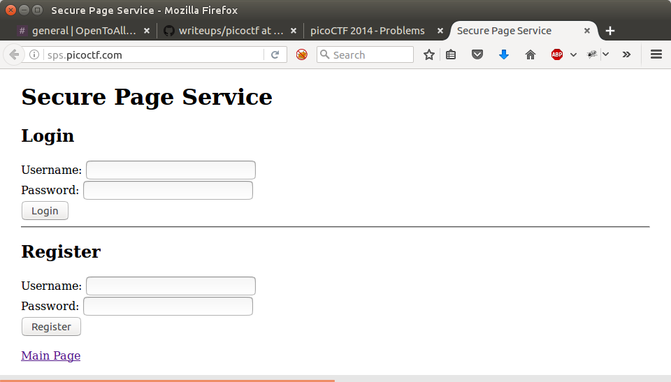
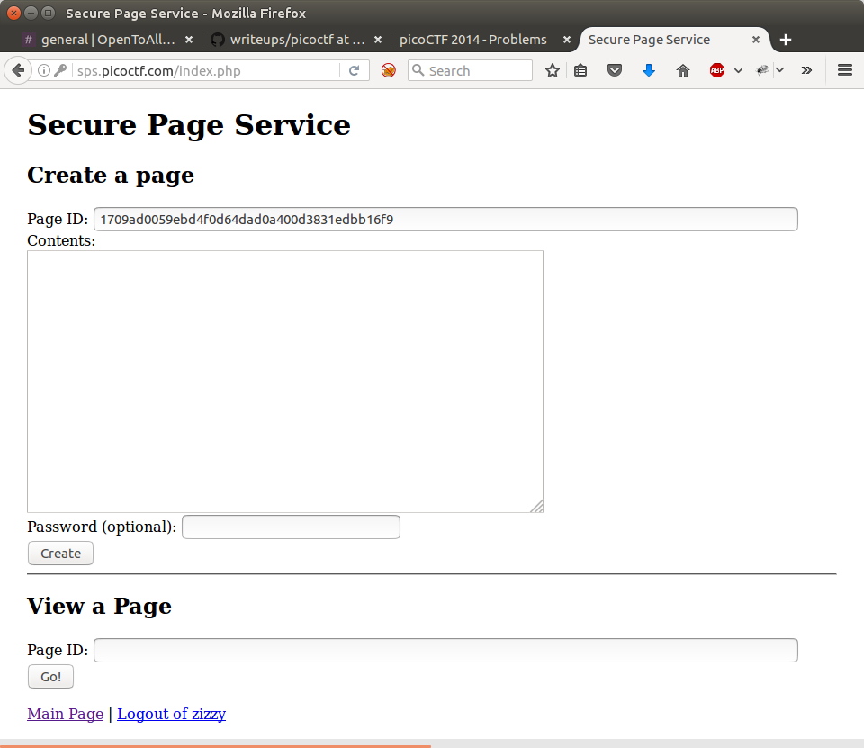
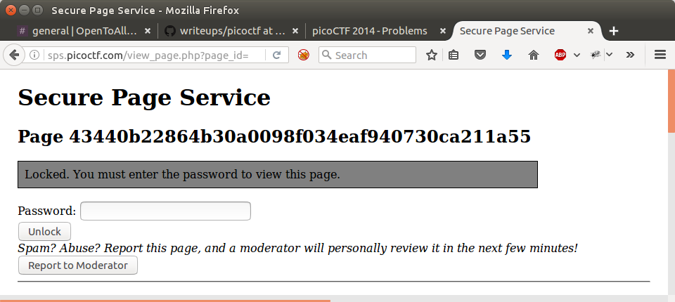
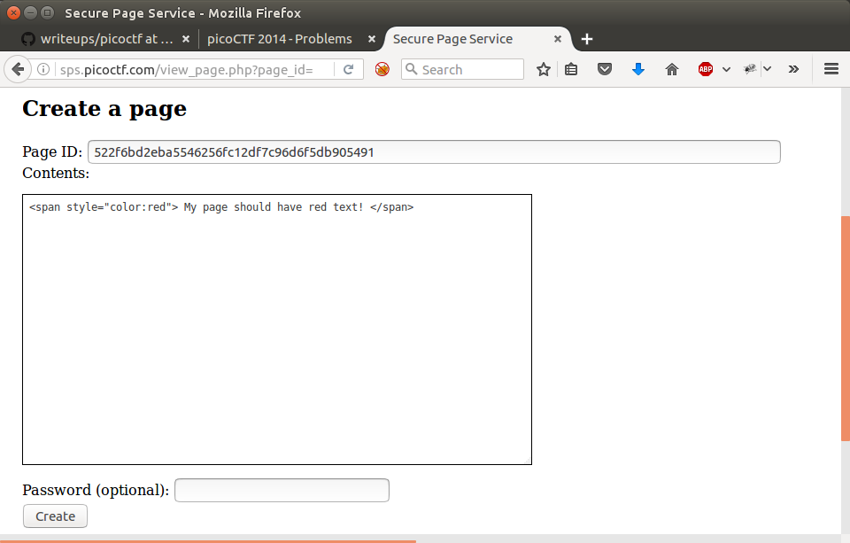
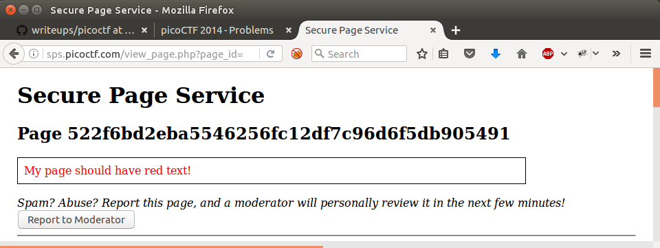

__secure_page_service__
===========

_John Hammond_ | _Tuesday, December 20th, 2016_ 

 
> The bad guys have hidden their access codes on an [anonymous secure page](http://sps.picoctf.com/) service. Our intelligence tells us that the codes was posted on a page with id `43440b22864b30a0098f034eaf940730ca211a55`, but unfortunately it's protected by a password, and only site moderators can view the post without the password. Can you help us recover the codes? 

----------

If you navigate to the page given, [`http://sps.picoctf.com/`](http://sps.picoctf.com/), you can see there are two forms given: login and registration.

Since we presumably don't have an account, we can __register__ one. I just used something stupid, like username `zizzy` and password `anything`. Apparently it has to be a unique username, so get creative, I guess.

Once you are "successfully registered"  you can go and log in as that new user.

Then we are greeted with a whole new page!

We can see that there is a form given on the top where we can supposedly "create a page." There is a textbox with a given "Page ID", which is where that id number given in the challenge description must have came from (the `43440b22864b30a0098f034eaf940730ca211a55`).

There is a big text area for us to put content and an optional password.

The form below it allows us to supposedly "view a page". All it asks for is a Page ID. Can we try and view the one that is given in the challenge prompt, the `43440b22864b30a0098f034eaf940730ca211a55`?

__Locked!__ We can't see it without the password, just like it said in the challenge prompt. Dang it.

But what else is there? There is this text:

> Spam? Abuse? Report this page, and a moderator will personally review it in the next few minutes!

Hmmm... a _moderator_ will review the page. So someone with more authority can come look at any page that we report on. _And_ we have the functionality to ___create___ pages. Can we inject anything in the pages? 

Let's try and create a page with some [HTML].

And after we go to view it...

___Aha!___ It parses and handles our [HTML]! We can do some malicious things, then!

Typically in [CTF] challenges when you see notes like ___an administrator will review your message shortly___ or ___a moderator will view the page___ you can expect it to be showcasing a [__cross-site scripting__][cross-site scripting] or _[XSS]_ vulnerability.

This is when you can inject [HTML], or, more pertinently, [Javascript] code to malicious things on an end-users web browser. Since that is all client-side code, usually it isn't the [Javascript] _itself_ that is evil or malicious... all it does is _hijack_ the victim's web browser to _redirect them_ or take them to a website that _does_ run more malicious code... often this attack is used to __steal a cookie__ with a [cookie catcher].

Since an _administrator_ or a _moderator_ will supposedly 

__Submit: `ssshhhhh_theres_a_backdoor`__ 

[netcat]: https://en.wikipedia.org/wiki/Netcat
[Wikipedia]: https://www.wikipedia.org/
[Linux]: https://www.linux.com/
[man page]: https://en.wikipedia.org/wiki/Man_page
[PuTTY]: http://www.putty.org/
[ssh]: https://en.wikipedia.org/wiki/Secure_Shell
[Windows]: http://www.microsoft.com/en-us/windows
[virtual machine]: https://en.wikipedia.org/wiki/Virtual_machine
[operating system]:https://en.wikipedia.org/wiki/Operating_system
[OS]: https://en.wikipedia.org/wiki/Operating_system
[VMWare]: http://www.vmware.com/
[VirtualBox]: https://www.virtualbox.org/
[hostname]: https://en.wikipedia.org/wiki/Hostname
[port number]: https://en.wikipedia.org/wiki/Port_%28computer_networking%29
[distribution]:https://en.wikipedia.org/wiki/Linux_distribution
[Ubuntu]: http://www.ubuntu.com/
[ISO]: https://en.wikipedia.org/wiki/ISO_image
[standard streams]: https://en.wikipedia.org/wiki/Standard_streams
[read]: http://ss64.com/bash/read.html
[variable]: https://en.wikipedia.org/wiki/Variable_%28computer_science%29
[command substitution]: http://www.tldp.org/LDP/abs/html/commandsub.html
[permissions]: https://en.wikipedia.org/wiki/File_system_permissions
[redirection]: http://www.tldp.org/LDP/abs/html/io-redirection.html
[tmp]: http://www.tldp.org/LDP/Linux-Filesystem-Hierarchy/html/tmp.html
[curl]: http://curl.haxx.se/
[cl1p.net]: https://cl1p.net/
[request]: http://www.w3.org/Protocols/rfc2616/rfc2616-sec5.html
[POST request]: https://en.wikipedia.org/wiki/POST_%28HTTP%29
[Python]: http://python.org/
[interpreter]: https://en.wikipedia.org/wiki/List_of_command-line_interpreters
[requests]: http://docs.python-requests.org/en/latest/
[urllib]: https://docs.python.org/2/library/urllib.html
[file handling with Python]: https://docs.python.org/2/tutorial/inputoutput.html#reading-and-writing-files
[bash]: https://www.gnu.org/software/bash/
[Assembly]: https://en.wikipedia.org/wiki/Assembly_language
[the stack]:  https://en.wikipedia.org/wiki/Stack_%28abstract_data_type%29
[register]: http://www.tutorialspoint.com/assembly_programming/assembly_registers.htm
[hex]: https://en.wikipedia.org/wiki/Hexadecimal
[archive file]: https://en.wikipedia.org/wiki/Archive_file
[zip file]: https://en.wikipedia.org/wiki/Zip_%28file_format%29
[gigabytes]: https://en.wikipedia.org/wiki/Gigabyte
[GB]: https://en.wikipedia.org/wiki/Gigabyte
[GUI]: https://en.wikipedia.org/wiki/Graphical_user_interface
[Wireshark]: https://www.wireshark.org/
[FTP]: https://en.wikipedia.org/wiki/File_Transfer_Protocol
[client and server]: https://simple.wikipedia.org/wiki/Client-server
[RETR]: http://cr.yp.to/ftp/retr.html
[FTP server]: https://help.ubuntu.com/lts/serverguide/ftp-server.html
[SFTP]: https://en.wikipedia.org/wiki/SSH_File_Transfer_Protocol
[SSL]: https://en.wikipedia.org/wiki/Transport_Layer_Security
[encryption]: https://en.wikipedia.org/wiki/Encryption
[HTML]: https://en.wikipedia.org/wiki/HTML
[Flask]: http://flask.pocoo.org/
[SQL]: https://en.wikipedia.org/wiki/SQL
[and]: https://en.wikipedia.org/wiki/Logical_conjunction
[Cyberstakes]: https://cyberstakesonline.com/
[cat]: https://en.wikipedia.org/wiki/Cat_%28Unix%29
[symbolic link]: https://en.wikipedia.org/wiki/Symbolic_link
[ln]: https://en.wikipedia.org/wiki/Ln_%28Unix%29
[absolute path]: https://en.wikipedia.org/wiki/Path_%28computing%29
[CTF]: https://en.wikipedia.org/wiki/Capture_the_flag#Computer_security
[Cyberstakes]: https://cyberstakesonline.com/
[OverTheWire]: http://overthewire.org/
[Leviathan]: http://overthewire.org/wargames/leviathan/
[ls]: https://en.wikipedia.org/wiki/Ls
[grep]: https://en.wikipedia.org/wiki/Grep
[strings]: http://linux.die.net/man/1/strings
[ltrace]: http://linux.die.net/man/1/ltrace
[C]: https://en.wikipedia.org/wiki/C_%28programming_language%29
[strcmp]: http://linux.die.net/man/3/strcmp
[access]: http://pubs.opengroup.org/onlinepubs/009695399/functions/access.html
[system]: http://linux.die.net/man/3/system
[real user ID]: https://en.wikipedia.org/wiki/User_identifier
[effective user ID]: https://en.wikipedia.org/wiki/User_identifier
[brute force]: https://en.wikipedia.org/wiki/Brute-force_attack
[for loop]: https://en.wikipedia.org/wiki/For_loop
[bash programming]: http://tldp.org/HOWTO/Bash-Prog-Intro-HOWTO.html
[Behemoth]: http://overthewire.org/wargames/behemoth/
[command line]: https://en.wikipedia.org/wiki/Command-line_interface
[command-line]: https://en.wikipedia.org/wiki/Command-line_interface
[cli]: https://en.wikipedia.org/wiki/Command-line_interface
[PHP]: https://php.net/
[URL]: https://en.wikipedia.org/wiki/Uniform_Resource_Locator
[TamperData]: https://addons.mozilla.org/en-US/firefox/addon/tamper-data/
[Firefox]: https://www.mozilla.org/en-US/firefox/new/?product=firefox-3.6.8&os=osx%E2%8C%A9=en-US
[Caesar Cipher]: https://en.wikipedia.org/wiki/Caesar_cipher
[Google Reverse Image Search]: https://www.google.com/imghp
[PicoCTF]: https://picoctf.com/
[JavaScript]: https://www.javascript.com/
[base64]: https://en.wikipedia.org/wiki/Base64
[client-side]: https://en.wikipedia.org/wiki/Client-side_scripting
[client side]: https://en.wikipedia.org/wiki/Client-side_scripting
[javascript:alert]: http://www.w3schools.com/js/js_popup.asp
[Java]: https://www.java.com/en/
[2147483647]: https://en.wikipedia.org/wiki/2147483647_%28number%29
[XOR]: https://en.wikipedia.org/wiki/Exclusive_or
[XOR cipher]: https://en.wikipedia.org/wiki/XOR_cipher
[RSA]: https://en.wikipedia.org/wiki/RSA_(cryptosystem)
[Cryptography]: https://en.wikipedia.org/wiki/Cryptography
[private key]: https://en.wikipedia.org/wiki/Public-key_cryptography
[public key]: https://en.wikipedia.org/wiki/Public-key_cryptography
[reverse engineering]: https://en.wikipedia.org/wiki/Reverse_engineering
[Towers of Hanoi]: https://en.wikipedia.org/wiki/Tower_of_Hanoi
[SSH]: https://en.wikipedia.org/wiki/Secure_Shell
[OpenSSH]: https://www.openssh.com/
[diff]: https://linux.die.net/man/1/diff
[xstrdup]: https://manned.org/xstrdup
[memfrob]: https://linux.die.net/man/3/memfrob
[pwntools]: https://github.com/Gallopsled/pwntools
[cross-site scripting]: https://en.wikipedia.org/wiki/Cross-site_scripting
[XSS]: https://en.wikipedia.org/wiki/Cross-site_scripting
[Javascript]: https://en.wikipedia.org/wiki/JavaScript
[cookie catcher]: hackwithstyle.blogspot.com/2011/11/what-is-cookie-catcher-and-how-to-get.html
[cookie-catcher]: hackwithstyle.blogspot.com/2011/11/what-is-cookie-catcher-and-how-to-get.html