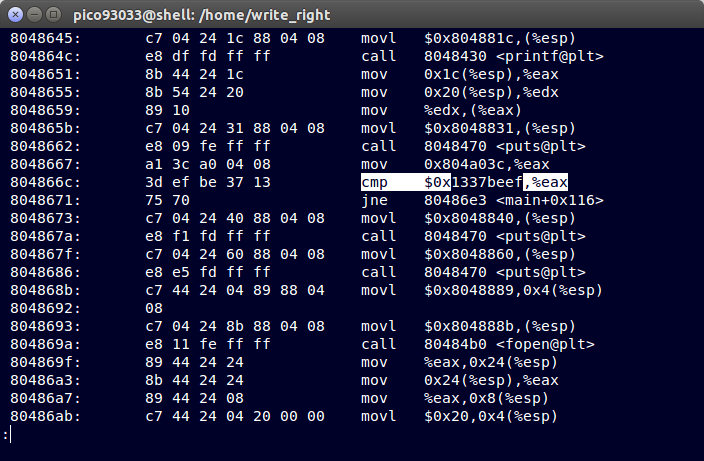
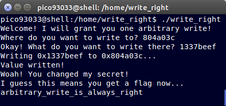

__Write Right__
===========

_John Hammond_ | _Sunday, December 13th, 2015_ 

 
> Can you change the secret? The binary can be found at /home/write_right/ on the shell server. The source can be found here.


----------

You can only interact with this program once you have connected to the [PicoCTF] [shell] with [`ssh`][ssh]. 
Connect with the credentials given to you on [their 'shell' page](https://picoctf.com/shell)

Change into the problem directory `/home/write_right` and check out the files. `write_right` is clearly the program we need to work with. Let's run it.

```
pico93033@shell:/home/write_right$ ./write_right 
Welcome! I will grant you one arbitrary write!
Where do you want to write to? aaaaaaa
Okay! What do you want to write there? aaaaaaaa
Writing 0xaaaaaaaa to 0xaaaaaaa...
Segmentation fault (core dumped)
```

Hmm, so according to it and the [source code](write_right.c), I can enter any address and supply a value for what should be there. The source code wants the value to be `0x1337beef`. 

On a whim I just disassembled the program with `objdump -D write_right` and poked around. I explored the `main` function, and saw something interesting..



It looked like it was comparing the `0x1337beef` value, all nice and easy for us! It compares it to whatever value is in the `eax` register, which we can clearly see being changed in the instruction just before it.

Well, that's all the information we really need, isn't it?



__Submit: `arbitrary_write_is_always_right`__

[netcat]: https://en.wikipedia.org/wiki/Netcat
[Wikipedia]: https://www.wikipedia.org/
[Linux]: https://www.linux.com/
[man page]: https://en.wikipedia.org/wiki/Man_page
[PuTTY]: http://www.putty.org/
[ssh]: https://en.wikipedia.org/wiki/Secure_Shell
[Windows]: http://www.microsoft.com/en-us/windows
[virtual machine]: https://en.wikipedia.org/wiki/Virtual_machine
[operating system]:https://en.wikipedia.org/wiki/Operating_system
[OS]: https://en.wikipedia.org/wiki/Operating_system
[VMWare]: http://www.vmware.com/
[VirtualBox]: https://www.virtualbox.org/
[hostname]: https://en.wikipedia.org/wiki/Hostname
[port number]: https://en.wikipedia.org/wiki/Port_%28computer_networking%29
[distribution]:https://en.wikipedia.org/wiki/Linux_distribution
[Ubuntu]: http://www.ubuntu.com/
[ISO]: https://en.wikipedia.org/wiki/ISO_image
[standard streams]: https://en.wikipedia.org/wiki/Standard_streams
[read]: http://ss64.com/bash/read.html
[variable]: https://en.wikipedia.org/wiki/Variable_%28computer_science%29
[command substitution]: http://www.tldp.org/LDP/abs/html/commandsub.html
[permissions]: https://en.wikipedia.org/wiki/File_system_permissions
[redirection]: http://www.tldp.org/LDP/abs/html/io-redirection.html
[tmp]: http://www.tldp.org/LDP/Linux-Filesystem-Hierarchy/html/tmp.html
[curl]: http://curl.haxx.se/
[cl1p.net]: https://cl1p.net/
[request]: http://www.w3.org/Protocols/rfc2616/rfc2616-sec5.html
[POST request]: https://en.wikipedia.org/wiki/POST_%28HTTP%29
[Python]: http://python.org/
[interpreter]: https://en.wikipedia.org/wiki/List_of_command-line_interpreters
[requests]: http://docs.python-requests.org/en/latest/
[urllib]: https://docs.python.org/2/library/urllib.html
[file handling with Python]: https://docs.python.org/2/tutorial/inputoutput.html#reading-and-writing-files
[bash]: https://www.gnu.org/software/bash/
[Assembly]: https://en.wikipedia.org/wiki/Assembly_language
[the stack]:  https://en.wikipedia.org/wiki/Stack_%28abstract_data_type%29
[register]: http://www.tutorialspoint.com/assembly_programming/assembly_registers.htm
[hex]: https://en.wikipedia.org/wiki/Hexadecimal
[hexadecimal]: https://en.wikipedia.org/wiki/Hexadecimal
[archive file]: https://en.wikipedia.org/wiki/Archive_file
[zip file]: https://en.wikipedia.org/wiki/Zip_%28file_format%29
[gigabytes]: https://en.wikipedia.org/wiki/Gigabyte
[GB]: https://en.wikipedia.org/wiki/Gigabyte
[GUI]: https://en.wikipedia.org/wiki/Graphical_user_interface
[Wireshark]: https://www.wireshark.org/
[FTP]: https://en.wikipedia.org/wiki/File_Transfer_Protocol
[client and server]: https://simple.wikipedia.org/wiki/Client-server
[RETR]: http://cr.yp.to/ftp/retr.html
[FTP server]: https://help.ubuntu.com/lts/serverguide/ftp-server.html
[SFTP]: https://en.wikipedia.org/wiki/SSH_File_Transfer_Protocol
[SSL]: https://en.wikipedia.org/wiki/Transport_Layer_Security
[encryption]: https://en.wikipedia.org/wiki/Encryption
[HTML]: https://en.wikipedia.org/wiki/HTML
[Flask]: http://flask.pocoo.org/
[SQL]: https://en.wikipedia.org/wiki/SQL
[and]: https://en.wikipedia.org/wiki/Logical_conjunction
[Cyberstakes]: https://cyberstakesonline.com/
[cat]: https://en.wikipedia.org/wiki/Cat_%28Unix%29
[symbolic link]: https://en.wikipedia.org/wiki/Symbolic_link
[ln]: https://en.wikipedia.org/wiki/Ln_%28Unix%29
[absolute path]: https://en.wikipedia.org/wiki/Path_%28computing%29
[CTF]: https://en.wikipedia.org/wiki/Capture_the_flag#Computer_security
[Cyberstakes]: https://cyberstakesonline.com/
[OverTheWire]: http://overthewire.org/
[Leviathan]: http://overthewire.org/wargames/leviathan/
[ls]: https://en.wikipedia.org/wiki/Ls
[grep]: https://en.wikipedia.org/wiki/Grep
[strings]: http://linux.die.net/man/1/strings
[ltrace]: http://linux.die.net/man/1/ltrace
[C]: https://en.wikipedia.org/wiki/C_%28programming_language%29
[strcmp]: http://linux.die.net/man/3/strcmp
[access]: http://pubs.opengroup.org/onlinepubs/009695399/functions/access.html
[system]: http://linux.die.net/man/3/system
[real user ID]: https://en.wikipedia.org/wiki/User_identifier
[effective user ID]: https://en.wikipedia.org/wiki/User_identifier
[brute force]: https://en.wikipedia.org/wiki/Brute-force_attack
[for loop]: https://en.wikipedia.org/wiki/For_loop
[bash programming]: http://tldp.org/HOWTO/Bash-Prog-Intro-HOWTO.html
[Behemoth]: http://overthewire.org/wargames/behemoth/
[command line]: https://en.wikipedia.org/wiki/Command-line_interface
[command-line]: https://en.wikipedia.org/wiki/Command-line_interface
[cli]: https://en.wikipedia.org/wiki/Command-line_interface
[PHP]: https://php.net/
[URL]: https://en.wikipedia.org/wiki/Uniform_Resource_Locator
[TamperData]: https://addons.mozilla.org/en-US/firefox/addon/tamper-data/
[Firefox]: https://www.mozilla.org/en-US/firefox/new/?product=firefox-3.6.8&os=osx%E2%8C%A9=en-US
[Caesar Cipher]: https://en.wikipedia.org/wiki/Caesar_cipher
[Google Reverse Image Search]: https://www.google.com/imghp
[PicoCTF]: https://picoctf.com/
[JavaScript]: https://www.javascript.com/
[base64]: https://en.wikipedia.org/wiki/Base64
[client-side]: https://en.wikipedia.org/wiki/Client-side_scripting
[client side]: https://en.wikipedia.org/wiki/Client-side_scripting
[javascript:alert]: http://www.w3schools.com/js/js_popup.asp
[Java]: https://www.java.com/en/
[2147483647]: https://en.wikipedia.org/wiki/2147483647_%28number%29
[XOR]: https://en.wikipedia.org/wiki/Exclusive_or
[XOR cipher]: https://en.wikipedia.org/wiki/XOR_cipher
[quipqiup.com]: http://www.quipqiup.com/
[PDF]: https://en.wikipedia.org/wiki/Portable_Document_Format
[pdfimages]: http://linux.die.net/man/1/pdfimages
[ampersand]: https://en.wikipedia.org/wiki/Ampersand
[URL encoding]: https://en.wikipedia.org/wiki/Percent-encoding
[Percent encoding]: https://en.wikipedia.org/wiki/Percent-encoding
[URL-encoding]: https://en.wikipedia.org/wiki/Percent-encoding
[Percent-encoding]: https://en.wikipedia.org/wiki/Percent-encoding
[endianness]: https://en.wikipedia.org/wiki/Endianness
[ASCII]: https://en.wikipedia.org/wiki/ASCII
[struct]: https://docs.python.org/2/library/struct.html
[pcap]: https://en.wikipedia.org/wiki/Pcap
[packet capture]: https://en.wikipedia.org/wiki/Packet_analyzer
[HTTP]: https://en.wikipedia.org/wiki/Hypertext_Transfer_Protocol
[Wireshark filters]: https://wiki.wireshark.org/DisplayFilters
[SSL]: https://en.wikipedia.org/wiki/Transport_Layer_Security
[Assembly]: https://en.wikipedia.org/wiki/Assembly_language
[Assembly Syntax]: https://en.wikipedia.org/wiki/X86_assembly_language#Syntax
[Intel Syntax]: https://en.wikipedia.org/wiki/X86_assembly_language
[Intel or AT&T]: http://www.imada.sdu.dk/Courses/DM18/Litteratur/IntelnATT.htm
[AT&T syntax]: https://en.wikibooks.org/wiki/X86_Assembly/GAS_Syntax
[GET request]: https://en.wikipedia.org/wiki/Hypertext_Transfer_Protocol#Request_methods
[GET requests]: https://en.wikipedia.org/wiki/Hypertext_Transfer_Protocol#Request_methods
[IP Address]: https://en.wikipedia.org/wiki/IP_address
[MAC Address]: https://en.wikipedia.org/wiki/MAC_address
[session]: https://en.wikipedia.org/wiki/Session_%28computer_science%29
[Cookie Manager+]: https://addons.mozilla.org/en-US/firefox/addon/cookies-manager-plus/